# Chapter III layout and linked TOC

Companion nest: [`README.md`](README.md). Paste-ready chapter: [`docs/chapter-iii-methodology.md`](../docs/chapter-iii-methodology.md).

Every header below has two links: the chapter permalink and the how-to note. Spine chain and tester legend sit under the TOC.

**Live tester exception.** Questions remains **Partial** until official RQ wording replaces PQ1/PQ2. Theme and Finding cells stay empty by design.

## Table of contents

1. [Introduction](../docs/chapter-iii-methodology.md#introduction) · [how-to](pages/H-001-introduction.md) · `CH3-H-001`
2. [Research Design](../docs/chapter-iii-methodology.md#research-design) · [how-to](pages/H-002-research-design.md) · `CH3-H-002`
    1. [Generic qualitative inquiry](../docs/chapter-iii-methodology.md#generic-qualitative-inquiry) · [how-to](pages/H-003-generic-qualitative-inquiry.md) · `CH3-H-003`
    2. [Critical-incident interview stance](../docs/chapter-iii-methodology.md#critical-incident-interview-stance) · [how-to](pages/H-004-critical-incident-interview-stance.md) · `CH3-H-004`
    3. [Framework role: sensitizing, not confirmatory](../docs/chapter-iii-methodology.md#framework-role-sensitizing-not-confirmatory) · [how-to](pages/H-005-framework-role-sensitizing-not-confirmatory.md) · `CH3-H-005`
    4. [Alignment spine](../docs/chapter-iii-methodology.md#alignment-spine) · [how-to](pages/H-006-alignment-spine.md) · `CH3-H-006`
3. [Population and Sampling](../docs/chapter-iii-methodology.md#population-and-sampling) · [how-to](pages/H-007-population-and-sampling.md) · `CH3-H-007`
    1. [Population](../docs/chapter-iii-methodology.md#population) · [how-to](pages/H-008-population.md) · `CH3-H-008`
    2. [Sampling strategy](../docs/chapter-iii-methodology.md#sampling-strategy) · [how-to](pages/H-009-sampling-strategy.md) · `CH3-H-009`
4. [Recruitment](../docs/chapter-iii-methodology.md#recruitment) · [how-to](pages/H-010-recruitment.md) · `CH3-H-010`
5. [Instrumentation](../docs/chapter-iii-methodology.md#instrumentation) · [how-to](pages/H-011-instrumentation.md) · `CH3-H-011`
    1. [Primary instrument](../docs/chapter-iii-methodology.md#primary-instrument) · [how-to](pages/H-012-primary-instrument.md) · `CH3-H-012`
    2. [Researcher-only leverage diagnostic](../docs/chapter-iii-methodology.md#researcher-only-leverage-diagnostic) · [how-to](pages/H-013-researcher-only-leverage-diagnostic.md) · `CH3-H-013`
    3. [Secondary instrument: artifacts as context](../docs/chapter-iii-methodology.md#secondary-instrument-artifacts-as-context) · [how-to](pages/H-014-secondary-instrument-artifacts-as-context.md) · `CH3-H-014`
6. [Data Collection](../docs/chapter-iii-methodology.md#data-collection) · [how-to](pages/H-015-data-collection.md) · `CH3-H-015`
7. [Data Preparation and Management](../docs/chapter-iii-methodology.md#data-preparation-and-management) · [how-to](pages/H-016-data-preparation-and-management.md) · `CH3-H-016`
8. [Qualitative Data Analysis](../docs/chapter-iii-methodology.md#qualitative-data-analysis) · [how-to](pages/H-017-qualitative-data-analysis.md) · `CH3-H-017`
    1. [Declaration of method](../docs/chapter-iii-methodology.md#declaration-of-method) · [how-to](pages/H-018-declaration-of-method.md) · `CH3-H-018`
    2. [Why this method and not the adjacent alternatives](../docs/chapter-iii-methodology.md#why-this-method-and-not-the-adjacent-alternatives) · [how-to](pages/H-019-why-this-method-and-not-the-adjacent-alternatives.md) · `CH3-H-019`
    3. [Analytic steps (adapted hybrid codebook TA)](../docs/chapter-iii-methodology.md#analytic-steps-adapted-hybrid-codebook-ta) · [how-to](pages/H-020-analytic-steps-adapted-hybrid-codebook-ta.md) · `CH3-H-020`
    4. [Delve nested start-list (import; do not treat as themes)](../docs/chapter-iii-methodology.md#delve-nested-start-list-import-do-not-treat-as-themes) · [how-to](pages/H-021-delve-nested-start-list-import-do-not-treat-as-themes.md) · `CH3-H-021`
    5. [Planned-analysis matrix](../docs/chapter-iii-methodology.md#planned-analysis-matrix) · [how-to](pages/H-022-planned-analysis-matrix.md) · `CH3-H-022`
    6. [Ten control rules](../docs/chapter-iii-methodology.md#ten-control-rules) · [how-to](pages/H-023-ten-control-rules.md) · `CH3-H-023`
    7. [Chapter III versus Chapter IV versus Chapter V](../docs/chapter-iii-methodology.md#chapter-iii-versus-chapter-iv-versus-chapter-v) · [how-to](pages/H-024-chapter-iii-versus-chapter-iv-versus-chapter-v.md) · `CH3-H-024`
    8. [Optional: committee-required second coder and ICR](../docs/chapter-iii-methodology.md#optional-committee-required-second-coder-and-icr) · [how-to](pages/H-025-optional-committee-required-second-coder-and-icr.md) · `CH3-H-025`
9. [Trustworthiness](../docs/chapter-iii-methodology.md#trustworthiness) · [how-to](pages/H-026-trustworthiness.md) · `CH3-H-026`
10. [Ethical Protections](../docs/chapter-iii-methodology.md#ethical-protections) · [how-to](pages/H-027-ethical-protections.md) · `CH3-H-027`
11. [Chapter Summary](../docs/chapter-iii-methodology.md#chapter-summary) · [how-to](pages/H-028-chapter-summary.md) · `CH3-H-028`
12. [References](../docs/chapter-iii-methodology.md#references) · [how-to](pages/H-029-references.md) · `CH3-H-029`

## Alignment spine (keep intact)

```mermaid
flowchart LR
  problem[Problem]
  purpose[Purpose]
  pqs[PQ1_PQ2]
  framework[Framework_sensitizing]
  sources[Data_sources]
  items[Instrument_questions]
  collection[Collection]
  codes[Codes]
  categories[Categories]
  themes[Themes_ChIV]
  findings[Findings_ChIV]
  conclusions[Conclusions_ChV]
  problem --> purpose
  purpose --> pqs
  pqs --> framework
  framework --> sources
  sources --> items
  items --> collection
  collection --> codes
  codes --> categories
  categories --> themes
  themes --> findings
  findings --> conclusions
```

Full map: [`registers/spine-map.csv`](registers/spine-map.csv). Theory lock: [`templates/theory.csv`](templates/theory.csv).

## Alignment tester legend

| Rating | Meaning |
| --- | --- |
| Strong | Written steps can collect or reduce Gap data |
| Partial | Concept is right; a locked artifact is still missing |
| Weak | Intent only; no collectable step |

Live scorecard: [`registers/alignment-testers.csv`](registers/alignment-testers.csv). Historical memo: [`docs/alignment-assessment-data-collection.md`](../docs/alignment-assessment-data-collection.md).

## Dissertation-event templates

Needed-item checklists (not a second copy of chapter prose):

- [`templates/chapter-i-needed-items.csv`](templates/chapter-i-needed-items.csv)
- [`templates/chapter-ii-lit-review.csv`](templates/chapter-ii-lit-review.csv)
- [`templates/chapter-iii-needed-items.csv`](templates/chapter-iii-needed-items.csv) (mirrors this TOC)
- [`templates/chapter-iv-needed-items.csv`](templates/chapter-iv-needed-items.csv) (Theme/Finding reserved)
- [`templates/chapter-v-needed-items.csv`](templates/chapter-v-needed-items.csv)
- Specialty: [`templates/qualitative.csv`](templates/qualitative.csv) · [`templates/us-sme.csv`](templates/us-sme.csv) · [`templates/qualitative-analysis.csv`](templates/qualitative-analysis.csv) · [`templates/lit-review.csv`](templates/lit-review.csv)
