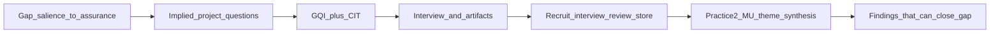

# Alignment Assessment of Data Collection Against the Gap

**Course context:** RSCH-V8927 Doctoral Project Development — Framework Development (building on BMGT8044)  
**Project:** Generic qualitative inquiry (GQI) of U.S. SME IT/network managers’ disaster-recovery governance on external platforms (ITDRPaaS)  
**Purpose of this memo:** Apply Project Plan Alignment Tracking and The Alignment Map: Guiding Questions to judge whether the proposed instruments, procedures, trustworthiness plan, and the four-step analysis already practiced in Data Analysis Practice 2 can produce and reduce the data needed to close the stated gap.

---

## Executive Summary

The collection design is **conceptually strong and operationally incomplete**. Stakeholder-salience theory, decision-rights governance, and recoverability assurance are the right constructs for the gap, and GQI plus critical-incident interviewing is the right methodological family. What is missing is the Alignment Map’s required demonstration that each gap element has a corresponding, answerable data source: an actual interview protocol, a workable artifact pipeline, ethics mitigations that protect those data, and an analysis path that does not collapse into confirmatory coding.

Data Analysis Practice 2 (Walker, 16 August 2026) already operationalizes a four-step generic thematic reduction (Aronson, 1994; Taylor & Bogdan, 1998; Braun & Clarke, 2021). That method can close the gap **if** Power, Legitimacy, Urgency, Decision Rights, Escalation, Evidentiary Standards, and Recoverability Assurance stay **sensitizing probes**, not pre-named themes. Because the current collection draft does not display interview steps, this memo uses **qualitative stakeholder-salience** (Mitchell et al., 1997) to supply the missing guiding questions: who had power, whose claim was treated as legitimate, what made restoration urgent, who held decision rights, how escalation was triggered, and what counted as sufficient proof.

**Overall alignment rating: Partial.** The chain from gap to intended data is coherent. The chain from intended data to collectable, analyzable, defensible evidence is not yet shown.

---

## 1. Alignment Media and Guiding Questions Used

Official Capella courseroom media — *Project Plan Alignment Tracking* and *The Alignment Map: Guiding Questions* — sit behind login and could not be retrieved verbatim. This memo applies the **same sequential chain those media enforce**, reconstructed from Capella’s published GQI and guiding-question guides, the course scoring language for Proposed Data Sources / Detailed Procedures / Trustworthiness, and the standard qualitative alignment road map (problem/gap → purpose/questions → methodology → methods → analysis → findings that address the gap).

### 1.1 Primary public Capella sources

| Source | What it requires of this project |
| --- | --- |
| [Writing Guiding Questions](https://campustools.capella.edu/BBCourse_Production/PhD_Colloquia_C4C/Track_3/phd_t3_u07s1_writeguide.html) | Interview items must be open-ended, answerable, assumption-explicit, written in participant language, and mapped to the research question. Topical guiding questions are used when the participant does not spontaneously raise a needed topic. |
| [Qualitative Data Collection Methods – SOBT](https://campustools.capella.edu/BBCourse_Production/PhD_Colloquia/Track_3/SOBT/phd_t3_sobt_u02s6_h01_qualcoll.html) | GQI collects theoretically informed, semi-structured accounts of **external events, opinions, and practices**, not phenomenological essence. Questions may be built from existing theoretical constructs. |

### 1.2 Alignment Map questions answered in this memo

For each link in the chain below, the rating is **Strong**, **Partial**, or **Weak**.

1. Does the gap name a phenomenon that qualitative data can actually capture?
2. Do the implied project questions restated the gap without changing the unit of analysis?
3. Is GQI (not phenomenology, case study, or a compliance audit) the congruent method?
4. Can the named instruments generate evidence for every gap element?
5. Do the procedures make those data obtainable, ethical, and stored?
6. Can the practiced analysis reduce those data into findings that answer the questions without confirming the framework in advance?
7. Do trustworthiness tactics protect the interpretive claims needed to close the gap?

### 1.3 Fallback rule used in this memo

Where the collection draft **does not display steps** (no numbered interview protocol, no artifact-request script, no analysis procedure in the project-plan data sections), this memo does not invent a new framework. It guides the missing steps with **qualitative stakeholder-salience**: power, legitimacy, and urgency as the mechanism by which managers decide whose claims count, then traces those shifts into decision rights, escalation, evidentiary standards, and recoverability assurance (Mitchell et al., 1997; Lowry et al., 2025).

---

## 2. The Gap and the Data It Requires

### 2.1 Gap restated as data needs

The gap is not “SME disaster recovery is under-researched.” It is more precise:

> Stakeholder theory says organizations must manage competing claims and sustain legitimacy, but the literature does not explain **how SME IT managers operationalize that claim management inside ITDRPaaS governance when cyber disruption forces time-critical recovery choices**. Stakeholder-salience theory names the mechanism (power, legitimacy, urgency), yet research remains limited on how those salience shifts become **decision rights, escalation pathways, and evidence standards** that make **recoverability assurance** defensible to stakeholders (Donaldson & Preston, 1995; Freeman et al., 2004; Mitchell et al., 1997; Lowry et al., 2025; Dorobantu et al., 2024).

That gap creates five data requirements:

| Gap element | Data the study must be able to produce |
| --- | --- |
| Stakeholder-claim management in SME ITDRPaaS | Incident narratives in which two or more parties made competing recovery claims |
| Salience shifts (power, legitimacy, urgency) | Accounts of whose demand “counted,” why, and how that ranking changed mid-incident |
| Decision rights and escalation | Who was authorized to make the tradeoff, who was bypassed, and what triggered escalation |
| Evidentiary standards / recoverability assurance | What counted as “enough” proof of restoration, who accepted or renegotiated that proof, and which artifacts (tickets, integrity checks, authorization records) were treated as reviewable evidence |
| Who cares / why now | How unclear authority or contested proof produced inconsistent recovery or disputed restoration legitimacy under time pressure |

### 2.2 Implied project questions

Official project-question wording was not in the source draft. Until that wording is pasted into the tracking table, Alignment Tracking uses these implied questions, written to stay inside GQI (external events and managerial accounts, not inner essence):

- **PQ1.** How do U.S. SME IT and network managers describe stakeholder-claim management and salience shifts (power, legitimacy, urgency) during ITDRPaaS recovery or testing incidents?
- **PQ2.** How do those shifts get enacted as decision rights, escalation pathways, and evidentiary / recoverability-assurance standards that managers can defend to stakeholders?

Paste the official RQ/PQ wording over these lines before courseroom submission.

**Rating: Strong** on gap-to-question alignment, **Partial** on documentation (official questions not shown).

---

## 3. Method Alignment: Why GQI Plus Critical Incident Fits

**Rating: Strong**, if phenomenological language is removed.

The gap is a **practice and governance** gap: how managers enact claim management under disruption. GQI is congruent because it seeks patterned accounts of real-world events, decisions, and conditions, and it permits interview questions built from theoretical constructs already in the literature (Percy et al., 2015; Kahlke, 2014; Caelli et al., 2003; Capella SOBT GQI guide). Critical-incident technique (CIT) is congruent because it anchors talk in one vivid recovery or test event rather than in abstract opinions about “governance.”

What is **not** congruent:

- Language of “lived experiences,” “socially constructed realities,” and “voices” in the current draft. Those phrases signal phenomenology. Capella GQI wants external events, opinions, and artifacts.
- Treating NIST, ISO, or BCM documents as independent variables or compliance checklists. That would be a documentary audit, not GQI.
- Treating the seven constructs as findings before interviews occur.

Keep GQI + CIT. Drop essence language. Cite CIT to Flanagan (1954), Chell (2004), or Butterfield et al. (2005), not to Donaldson and Preston (1995) or Guest et al. (2006).

---

## 4. Instruments: Measures or Artifacts to Be Reviewed

**Rating: Partial.** The draft names the right instruments and the right constructs. It does not show the instrument.

### 4.1 What the draft gets right

The primary instrument is a semi-structured interview protocol that (a) opens with a critical-incident account of IT disaster-recovery platform use and (b) is intended to explore power, legitimacy, urgency, decision rights, and proof under pressure. That is aligned with PQ1 and PQ2.

The secondary instrument — review of organizational artifacts **referenced by the manager during the incident account** — is also aligned, provided those artifacts stay “situated contextual objects” (plans, escalation matrices, test evidence, tickets, authorization records) and are not scored as NIST/BCM compliance. Recoverability assurance is already operationalized correctly as *decision-relevant, reviewable evidence* that prioritized services can be restored within tolerance (documented restoration outcomes, integrity checks, recorded authorization). That is the data object the gap needs.

### 4.2 What Alignment Tracking still cannot see

Alignment Map guiding questions require a visible map from each interview item to a project question. The draft asserts that queries are “mapped directly” to Power, Legitimacy, Urgency, Decision Rights, Escalation, Evidentiary Standards, and Recoverability Assurance. No items are displayed. Capella reviewers treat an undescribed protocol as incomplete instrumentation, not as implied competence.

Because **no interview steps appear in the document**, the recommended protocol in Section 8 is guided by qualitative stakeholder-salience rather than by a hidden instrument.

### 4.3 Construct-to-data tracking table

| Gap need | Data required | What the current draft collects | Rating | Fix |
| --- | --- | --- | --- | --- |
| Stakeholder-claim management | One concrete incident in which competing claims were made | CIT opening is described; no actual opening prompt | Partial | Write the CIT opening (Section 8.1) |
| Power | Who could force, delay, or override a recovery choice | Named as a code; no probe | Partial | Salience probe set A |
| Legitimacy | Whose claim was treated as rightful or “in role” | Named as a code; no probe | Partial | Salience probe set B |
| Urgency | What made restoration time-critical and how that ranking moved | Named as a code; no probe | Partial | Salience probe set C |
| Decision rights | Who was authorized to make the tradeoff; who was bypassed | Described in procedures; no item | Partial | Enactment probe set D |
| Escalation | What trigger moved the decision, and whether delay followed | Described; no item | Partial | Enactment probe set E |
| Evidentiary standards | What counted as “enough” proof; whether the threshold was renegotiated | Claimed in paragraph 3; no item | Partial | Assurance probe set F |
| Recoverability assurance | Reviewable artifacts supporting the restoration claim | Defined well; acquisition path missing | Partial | Artifact request + fallback (Section 8.2) |
| Formal intent vs. ad hoc action | Comparison of stated RTO/priority vs. what was actually restored | Artifact review named; no obtain/code rule | Weak | Field-note artifact map coded to the same MU table |
| Who cares / why now | Contested legitimacy of restoration under time pressure | Present in the gap, not instrumented | Partial | Close the interview with a “who had to be convinced, and with what” prompt |

---

## 5. Detailed Procedures

**Rating: Partial.** Recruitment is the strongest procedure. Interview execution and artifact handling are the weakest.

### 5.1 Recruitment, screening, onboarding — Strong

Purposive/criterion sampling of 10–15 U.S. SME IT or network managers (or equivalent operations roles) in firms of 10–200 staff, with direct responsibility for external-platform recovery and at least one disruption, failover, test, or operational recovery in 36 months, is aligned with the population named in the gap. Excluding vendor-only employees keeps the unit of analysis on SME managers, not on the platform provider. Informed consent before scheduling a virtual, recorded, English-language interview is the correct onboarding sequence.

What still needs to be written so sampling stays aligned:

- **Information power, not ritual saturation.** n = 10–15 is defensible because the sample is narrow, the aim is practice description, and the dialogue is theoretically informed (Malterud et al., 2016). Guest et al. (2006) may support a stopping rule, but it is not a recruitment citation and it is not a CIT citation.
- State interview length (60–75 minutes is consistent with a CIT opening plus salience and assurance probes).
- State the recruitment channel (professional networks, LinkedIn, practitioner associations) so feasibility can be judged.

### 5.2 Interview execution — Partial

The procedure correctly sequences a standardized ethics script, a CIT opening, and flexible probes. It then loses alignment in three ways:

1. **No steps are written.** “The researcher guides the dialogue using open-ended questions… operationalized around power, legitimacy, and urgency” is an intention, not a protocol. Until items exist, stakeholder-salience is the guide (Section 8.1).
2. **Wrong CIT citations.** Donaldson and Preston (1995) are stakeholder-theory sources. Guest et al. (2006) address saturation. Neither is the critical-incident method.
3. **Lived-experience framing.** The session is described as exploring “lived experiences in their own terms.” For GQI, the session explores **how managers handled a named recovery or test event**, in their own words, about external decisions and artifacts.

### 5.3 Artifact review — Weak to Partial

This is the largest procedure-to-gap hole. The gap needs a comparison of nominal continuity intent (risk tolerance, critical-service priorities, acceptable downtime) with ad hoc decisions. The draft says the researcher will “systematically” review referenced artifacts and keep field notes. It never states:

- how the artifact is requested after the incident story;
- what happens if the manager cannot share a DR plan, matrix, or ticket;
- how excerpts are de-identified at firm and vendor level;
- how an “artifact map” is entered into the same meaning-unit table used for talk;
- that NIST/BCM documents remain context, not confirming data for a theme (the same rule Practice 2 used when holding Padilla & Chantler, 2011, out of confirming excerpts).

Without those steps, artifact data may never arrive, and PQ2’s recoverability-assurance claim cannot be evidenced.

### 5.4 After the session — Partial

Verbatim transcription, de-identification, alphanumeric codes, and encrypted storage are aligned with dependability and confidentiality. Member checking is named but not specified: no turnaround window, no rule for what participants may edit, and no plan for politically sanitized decision-rights talk. If a manager “corrects” an account of contested proof, the study can lose the exact data the gap requires. The trustworthiness section must treat that as a threat, not only as a courtesy.

---

## 6. Practice 2 Analysis Fit

**Rating: Strong as a reduction method; Weak if the seven codes are used as pre-named themes.**

### 6.1 What Data Analysis Practice 2 already demonstrated

Walker (16 August 2026), BMGT8044 Week 5, applied generic thematic analysis to the course fashion-shopping sample (three UK women’s focus groups). The paper is **not** ITDR findings. It is the analysis method already practiced. The sequence was:

1. Identify patterns and lock **meaning units** before any theme names (Aronson, 1994; Taylor & Bogdan, 1998).
2. Confirm each unit with a named excerpt **and** a negative or boundary case.
3. Group related units into themes that state a **meaning-claim**, not a topic noun. Relatedness meant the same bargain, not the same shopping topic.
4. Synthesize so **each research question is answered separately** (Braun & Clarke, 2021; Percy et al., 2015; Lester et al., 2020).

Quality rules that must travel to the ITDR study:

| Practice 2 rule | Why it serves this gap |
| --- | --- |
| MU table: meaning-claim, inclusion bound, confirming excerpt, boundary case | Dependability audit trail for how salience and proof were interpreted |
| Theme 2, “conditional virtual evidence” | Direct analog of recoverability assurance: evidence accepted when it reduces risk, dismissed when it does not |
| Separate answers for main question and sub-question | Prevents collapsing salience, decision rights, and proof into one “recovery story” |
| Boundary cases kept inside the theme (Alex/Ola; Edinburgh skepticism after the Manchester chorus) | Keeps contested authority and failed-proof incidents inside the finding |
| Stimulus paper held out of confirming data | NIST/BCM/ISO stay context; they do not prove a governance theme |
| Saturation as a decision guide, not a destination (Naeem et al., 2024) | n = 10–15 does not automatically close the gap |

### 6.2 Conflict with the collection draft

The collection draft pre-names seven analytic codes and claims “absolute methodological alignment.” Practice 2, following Aronson (1994), forbids writing theme names first and treats researcher preconceptions as an analytic threat. If Power / Legitimacy / Urgency / Decision Rights / Escalation / Evidentiary Standards / Recoverability Assurance are locked as Step 3 themes before meaning units are confirmed, collection and analysis will be **out of alignment with each other** and with GQI.

Practice 2 also still uses “lived experience” and “essence” in places. That is the same phenomenology drift already in the collection draft. Both documents should be restated as patterned accounts of **external events, decisions, and artifacts** (Percy et al., 2015; Capella SOBT GQI guide).

Practice 2 analyzed talk only. The ITDR design adds artifacts. The aligned extra move is still GQI: enter each referenced plan, matrix, ticket, or authorization record in the MU table as a **confirming or boundary excerpt**, not as a compliance score.

### 6.3 Analysis bridge (use this, do not start over)

1. Keep the seven constructs as a **sensitizing start-list and topical interview probes**, guided by stakeholder-salience when no finer steps exist.
2. Run Practice 2 Steps 1–2 inductively on incident talk plus artifact maps.
3. In Step 3, test whether related meaning units form the same **salience-to-assurance bargain** (who counted → who decided → what counted as proof), not merely the same recovery topic.
4. Only then map emergent themes back to the gap mechanism: power, legitimacy, and urgency → decision rights and escalation → evidentiary standards and recoverability assurance.
5. Require at least one boundary case per construct (for example, a manager who never escalated, or who restored without reviewable proof).
6. Answer PQ1 and PQ2 in separate synthesis paragraphs.

---

## 7. Ethics and Trustworthiness Against the Gap

**Rating: Partial.** The right qualitative criteria are named. They are not yet tied to the data the gap requires, and ethical threats are under-specified relative to the scoring guide.

### 7.1 What is already aligned

The draft correctly rejects Cronbach’s alpha and uses Lincoln and Guba’s (1985) credibility, dependability, confirmability, and transferability, with Korstjens and Moser (2018) as the applied trustworthiness guide. Prolonged engagement with critical-incident narratives, member checks, protocol documentation, reflexivity, and rich description without naming firms are the right family of tactics.

### 7.2 Threats that can distort gap data

| Threat | How it damages gap data | Mitigation to write into the plan |
| --- | --- | --- |
| Organizational disclosure of DR plans, incident detail, or vendor relationships | Managers withhold the exact proof and escalation talk PQ2 needs | Artifact sharing is optional; refusal does not end the interview; field-note reconstruction of what the artifact *did* is enough |
| Dual identifiability (person + firm + vendor) | Re-identification risk suppresses candid decision-rights accounts | Strip firm, vendor, product, and city identifiers; alphanumeric participant codes; encrypted, password-protected storage |
| Mid-incident political sensitivity | Member checking becomes sanitizing | Participants may correct factual mishearing; they may not delete analytic excerpts about contested proof. Offer a short (e.g., 7-day) review window |
| Researcher allegiance to the seven codes | Confirmability failure; findings replay Mitchell et al. | Sensitizing probes + MU table + reflexive memo after each interview (Braun & Clarke, 2019) |
| Recording or platform failure | Lost incident narrative | Secondary notes in real time; stop and reschedule if recording fails before the CIT story is complete |
| Coercive sampling (subordinate recruited by a boss) | Inflated legitimacy of official plans | Individual recruitment; no supervisor-visible participation list |
| Manager self-justification treated as proof | Recoverability assurance becomes rhetoric | Distinguish “what I told stakeholders” from “what artifact existed”; code both |

Credibility for this study means the incident story is concrete enough to show salience movement. Dependability means another reader can follow the MU table from quote to theme to PQ1/PQ2. Confirmability means stakeholder-salience guided questions, not predetermined themes. Transferability means rich incident description (firm size band, role, platform type, incident type) without naming organizations.

---

## 8. Recommended Tightening (Same Study, Visible Steps)

Not a new design. The following supplies the steps the current document does not show, using qualitative stakeholder-salience as the guide.

### 8.1 Interview protocol (appendix-ready)

**Opening (ethics, 2–3 minutes).** Restate purpose, voluntary participation, withdrawal, recording, confidentiality of person and organization, and that no disaster-recovery document need be shared.

**CIT opening (PQ1; 10–15 minutes).**  
*Please walk me through one specific disruption, failover, recovery test, or operational recovery in the last 36 months where you used an external recovery platform or managed recovery service. Start wherever the event became your problem, and tell me what happened in as much detail as you can.*

Do not introduce theory terms in the opening. If the participant stays abstract, use a focusing follow-up: *If you can, stay with that one event rather than with how recovery usually works.*

**If the participant does not spontaneously raise a needed topic, use these topical guiding questions.** They are written in manager language. Theoretical labels stay in the codebook, not in the question (Capella guiding-question rules: open, answerable, no hidden assumption, no forced choice).

**Salience set A — Power (PQ1)**  
- *In that event, whose request or pressure most affected what got restored first?*  
- *Was there anyone who could delay, override, or stop a recovery action you thought was right?*  
- *If that pressure had not been there, what would you have done differently?*

**Salience set B — Legitimacy (PQ1)**  
- *Whose claim to a service or a recovery order did people treat as legitimate — as “they have a right to ask for this”?*  
- *Was anyone’s request treated as out of line or outside their role? What happened then?*

**Salience set C — Urgency (PQ1)**  
- *What made one service or one stakeholder more time-critical than another in that event?*  
- *Did that sense of urgency change while you were working the incident? What changed it?*

**Enactment set D — Decision rights (PQ2)**  
- *Who was supposed to make the call on that tradeoff, and who actually made it?*  
- *Was there a moment when you needed authority you did not have? What did you do?*

**Enactment set E — Escalation (PQ2)**  
- *What, if anything, triggered an escalation?*  
- *Did escalation speed the restoration, slow it, or change what “done” meant?*

**Assurance set F — Evidentiary standards and recoverability assurance (PQ2)**  
- *When you told others the service was recovered, what did you treat as enough proof?*  
- *Did anyone ask for different proof mid-incident? What did you do?*  
- *Looking back, what would you point to — a log, a test, an approval, a ticket — if you had to defend that restoration?*

**Closing.**  
- *Is there anything about who had to be convinced, and with what, that I have not asked about?*  
Then the artifact request in 8.2.

Flexible probes only: *What would be an example of that? Please say more about that moment. Who else was in that conversation?*

### 8.2 Artifact request and fallback

After the incident story:

*You mentioned [plan / matrix / ticket / test / approval]. I do not need a confidential file. If you are allowed to share a redacted excerpt, that helps me see how the written process compared with what you actually did. If you cannot share it, please just describe what that document or record did in the event — who used it, who ignored it, and whether it counted as proof.*

If nothing can be shared, write a field-note reconstruction: artifact type, role in the incident, whether it confirmed or contradicted the spoken account, and which meaning unit it later supports or bounds. Do not score the artifact against NIST, ISO, or BCM. Those frameworks remain context, as the Shoogleit paper remained context in Practice 2.

### 8.3 Ethics paragraph to insert in Detailed Procedures

The principal ethical threats are organizational disclosure, dual identifiability, and distortion of politically sensitive governance talk. Participants may refuse any artifact request without ending the interview. Transcripts, field notes, and artifact maps are stripped of person, firm, vendor, and product names and stored in an encrypted, password-protected directory under alphanumeric codes. Recording failure before the critical-incident narrative is complete stops the session. Member checking is limited to factual accuracy within a stated review window; participants are told that contested recovery decisions remain part of the de-identified analysis. The researcher keeps a short reflexive memo after each interview so stakeholder-salience sensitizing concepts are not mistaken for findings.

### 8.4 Language and citation repairs

Replace:

- “lived experiences” / “essence” / “voices” → *managers’ accounts of a named recovery or test event* / *patterned descriptions of decisions and artifacts*
- “absolute methodological alignment” to seven codes → *sensitizing concepts that guide topical questions; themes remain emergent*
- Donaldson & Preston (1995) or Guest et al. (2006) as CIT → Flanagan (1954), Chell (2004), or Butterfield et al. (2005)
- Guest et al. (2006) as the interview-execution source → keep only for a saturation/stopping discussion, alongside Malterud et al. (2016) and Naeem et al. (2024)
- NIST (2024) as an analysis method → context for what managers may reference, not a coding system
- leftover draft artifacts (`;3)`, doubled parentheses, “such other auditing parameters BCM and NIST”) → delete or rewrite as *internal DR plans, escalation matrices, recovery-test records, and, when managers name them, external references such as NIST or BCM frameworks*

### 8.5 Proposed Data Analysis paragraph to add to the project plan

Analysis will reuse the four-step generic thematic reduction practiced in Data Analysis Practice 2 (Aronson, 1994; Taylor & Bogdan, 1998; Braun & Clarke, 2021). After repeated reading of each de-identified transcript and artifact map, the researcher will (1) lock meaning units that state a practice claim before any theme name is written, (2) confirm each unit with a named excerpt and a negative or boundary case, (3) group related units only when they describe the same salience-to-assurance bargain, and (4) synthesize two separate answers, one for stakeholder-claim/salience enactment and one for decision rights, escalation, and recoverability assurance. Stakeholder-salience constructs (power, legitimacy, urgency) and the related governance constructs (decision rights, escalation, evidentiary standards, recoverability assurance) function as a sensitizing start-list for missing interview steps and for later mapping, not as predetermined theme titles. Saturation is treated as an analytic decision guide (Naeem et al., 2024), not as a claim that 10–15 interviews automatically close the gap.

---

## 9. Link-by-Link Alignment Score

| Alignment Map link | Rating | One-line judgment |
| --- | --- | --- |
| Gap → implied questions | Strong / Partial | Questions restate the gap; official wording still needed |
| Questions → GQI + CIT | Strong | External-event inquiry; drop phenomenological wording |
| Questions → instruments | Partial | Right instruments named; protocol not shown |
| Instruments → procedures | Partial | Screening is strong; artifact path and interview steps are not |
| Procedures → Practice 2 analysis | Partial | Four-step method fits; seven pre-named codes do not |
| Analysis → findings that close the gap | Conditional | Can close the gap if probes stay sensitizing and boundary cases are kept |
| Ethics/trustworthiness → data quality | Partial | Criteria correct; organizational-risk and member-check rules missing |

**Composite: Partial.** The study is aimed at the right gap with the right method. It does not yet prove that the data needed to close that gap will be asked for, obtained, and reduced without confirming the framework in advance.

---

## 10. Conclusions and Next Actions

1. Keep GQI, CIT, SME manager criteria, artifact-as-context, and the recoverability-assurance definition.
2. Add the Section 8 protocol. Where the project plan still has no steps, let qualitative stakeholder-salience (who had power, whose claim was legitimate, what was urgent) guide the questions, then follow the same incident into decision rights, escalation, and proof.
3. Recast the seven labels as sensitizing concepts. Run Practice 2 Steps 1–4 on talk plus artifact maps. Answer PQ1 and PQ2 separately.
4. Write the artifact fallback and the ethics-threat paragraph; they are what make PQ2 collectable.
5. Repair citations and GQI language before the full Project Plan is presented.
6. Paste official project questions into Section 2.2 when available.

These adjustments do not change the study. They make the Alignment Map visible: every gap element has a question, every question has a data source, and every data source has a reduction step that can produce a defensible answer rather than a restatement of Mitchell et al. (1997).

---

## Sources Cited in This Assessment

Aronson, J. (1994). A pragmatic view of thematic analysis. *The Qualitative Report, 2*(1), 1–3. https://doi.org/10.46743/2160-3715/1995.2069

Braun, V., & Clarke, V. (2019). Reflecting on reflexive thematic analysis. *Qualitative Research in Sport, Exercise and Health, 11*(4), 589–597. https://doi.org/10.1080/2159676X.2019.1628806

Braun, V., & Clarke, V. (2021). One size fits all? What counts as quality practice in (reflexive) thematic analysis? *Qualitative Research in Psychology, 18*(3), 328–352. https://doi.org/10.1080/14780887.2020.1769238

Butterfield, L. D., Borgen, W. A., Amundson, N. E., & Maglio, A.-S. T. (2005). Fifty years of the critical incident technique: 1954–2004 and beyond. *Qualitative Research, 5*(4), 475–497. https://doi.org/10.1177/1468794105056924

Caelli, K., Ray, L., & Mill, J. (2003). ‘Clear as mud’: Toward greater clarity in generic qualitative research. *International Journal of Qualitative Methods, 2*(2), 1–13. https://doi.org/10.1177/160940690300200201

Capella University. (n.d.). *Qualitative data collection and analysis methods – SOBT*. https://campustools.capella.edu/BBCourse_Production/PhD_Colloquia/Track_3/SOBT/phd_t3_sobt_u02s6_h01_qualcoll.html

Capella University. (n.d.). *Writing guiding questions*. https://campustools.capella.edu/BBCourse_Production/PhD_Colloquia_C4C/Track_3/phd_t3_u07s1_writeguide.html

Chell, E. (2004). Critical incident technique. In C. Cassell & G. Symon (Eds.), *Essential guide to qualitative methods in organizational research* (pp. 45–60). SAGE.

Donaldson, T., & Preston, L. E. (1995). The stakeholder theory of the corporation: Concepts, evidence, and implications. *Academy of Management Review, 20*(1), 65–91. https://doi.org/10.5465/amr.1995.9503271992

Dorobantu, S., Henisz, W. J., & Nartey, L. J. (2024). Firm–stakeholder dialogue and the media: The evolution of stakeholder evaluations in different informational environments. *Academy of Management Journal, 67*(1), 9–30. (as cited in the project gap statement)

Flanagan, J. C. (1954). The critical incident technique. *Psychological Bulletin, 51*(4), 327–358. https://doi.org/10.1037/h0061470

Freeman, R. E., Wicks, A. C., & Parmar, B. (2004). Stakeholder theory and “the corporate objective revisited.” *Organization Science, 15*(3), 364–369. https://doi.org/10.1287/orsc.1040.0066

Guest, G., Bunce, A., & Johnson, L. (2006). How many interviews are enough? An experiment with data saturation and variability. *Field Methods, 18*(1), 59–82. https://doi.org/10.1177/1525822X05279903

Kahlke, R. M. (2014). Generic qualitative approaches: Pitfalls and benefits of methodological mixology. *International Journal of Qualitative Methods, 13*(1), 37–52. https://doi.org/10.1177/160940691401300119

Korstjens, I., & Moser, A. (2018). Series: Practical guidance to qualitative research. Part 4: Trustworthiness and publishing. *European Journal of General Practice, 24*(1), 120–124. https://doi.org/10.1080/13814788.2017.1375092

Lester, J. N., Cho, Y., & Lochmiller, C. R. (2020). Learning to do qualitative data analysis: A starting point. *Human Resource Development Review, 19*(1), 94–106. https://doi.org/10.1177/1534484320903890

Lincoln, Y. S., & Guba, E. G. (1985). *Naturalistic inquiry*. SAGE.

Lowry, P. B., Petter, S., & Leimeister, J. M. (2025). (as cited in the project plan for recoverability assurance and decision-relevant evidence)

Malterud, K., Siersma, V. D., & Guassora, A. D. (2016). Sample size in qualitative interview studies: Guided by information power. *Qualitative Health Research, 26*(13), 1753–1760. https://doi.org/10.1177/1049732315617444

Mitchell, R. K., Agle, B. R., & Wood, D. J. (1997). Toward a theory of stakeholder identification and salience: Defining the principle of who and what really counts. *Academy of Management Review, 22*(4), 853–886. https://doi.org/10.5465/amr.1997.9711022105

Naeem, M., Ozuem, W., Howell, K., & Ranfagni, S. (2024). Demystification and actualization of data saturation in qualitative research through thematic analysis. *International Journal of Qualitative Methods, 23*.

Percy, W. H., Kostere, K., & Kostere, S. (2015). Generic qualitative research in psychology. *The Qualitative Report, 20*(2), 76–85. https://doi.org/10.46743/2160-3715/2015.2097

Taylor, S. J., & Bogdan, R. (1998). *Introduction to qualitative research methods* (3rd ed.). John Wiley & Sons.

Walker, M. D. (2026, August 16). *Week 5 assignment: Data analysis practice 2* [Unpublished course paper]. BMGT8044, Capella University.
