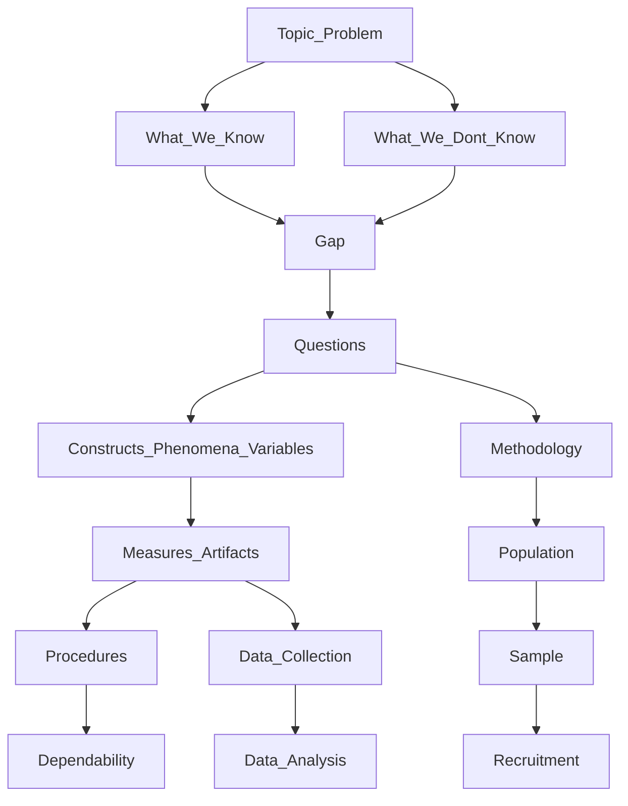

# Alignment Assessment of Data Collection Against the Gap

**Course context:** RSCH-V8927 Doctoral Project Development — Framework Development (building on BMGT8044)  
**Project:** Generic qualitative inquiry (GQI) of U.S. SME IT/network managers’ disaster-recovery governance on external platforms (ITDRPaaS)  
**Media applied:** *The Alignment Map: Guiding Questions* (courseroom interactive map: “Select each marker icon to learn about each component of the framework”) and *Project Plan Alignment Tracking*

---

## Executive Summary

Read against the official Alignment Map, the collection design is **conceptually strong and operationally incomplete**. The map requires a visible downward chain:

**Topic/Problem → What We Know / What We Don’t Know → Gap → Questions → Constructs/Phenomena → Measures/Artifacts → Data Collection → Data Analysis**

with a right-hand methodology column (**Methodology → Population → Sample → Recruitment**) and a left-hand quality column (**Procedures → Dependability**).

Your gap, constructs, and intended measures sit in the right boxes. **Data Collection** is the weak node: the draft names instruments but does not show collection steps. Where those steps are missing, this memo does not invent a new framework. It uses **qualitative stakeholder-salience** (power, legitimacy, urgency) to guide the missing questions, then follows the same incident into decision rights, escalation, and recoverability assurance (Mitchell et al., 1997).

Data Analysis Practice 2 already supplies the **Data Analysis** node (four-step generic thematic reduction). That node stays aligned only if the seven labels remain sensitizing probes, not pre-named themes.

**Overall Alignment Map rating: Partial.** Gap → Questions → Constructs is coherent. Measures/Artifacts → Data Collection → Data Analysis is not yet shown as a collectable, reducible path.

---

## 1. The Official Alignment Map

The courseroom media is an interactive flowchart. Each node has a marker icon; selecting the marker opens that component’s guiding questions. Nodes marked with an asterisk (*) on the map are the design/operations cluster (methodology, population, sample, recruitment, procedures, dependability, data collection).

**Data Collection is not a free-standing choice.** On the map it is preceded by Measures/Artifacts, which are preceded by Constructs, which are preceded by Questions, which are preceded by the Gap. Laterally it must stay consistent with Procedures and Dependability, and with the Methodology → Population → Sample → Recruitment column.

**Fallback rule.** If a node has no written steps in the project-plan draft, qualitative stakeholder-salience guides that node: whose claim had power, whose claim was treated as legitimate, what made recovery urgent, who held the decision right, what triggered escalation, and what counted as enough proof (Mitchell et al., 1997; Lowry et al., 2025).

Supporting Capella guides (not a substitute for the map):

- [Writing Guiding Questions](https://campustools.capella.edu/BBCourse_Production/PhD_Colloquia_C4C/Track_3/phd_t3_u07s1_writeguide.html) — open, answerable, assumption-explicit items mapped to the question.
- [Qualitative Data Collection Methods – SOBT](https://campustools.capella.edu/BBCourse_Production/PhD_Colloquia/Track_3/SOBT/phd_t3_sobt_u02s6_h01_qualcoll.html) — GQI collects theoretically informed accounts of **external events and practices**, not phenomenological essence.

---

## 2. Node-by-Node Alignment (Marker Walk)

Each marker below is scored **Strong / Partial / Weak** against the draft you supplied (gap, proposed data sources, detailed procedures, trustworthiness) and against Data Analysis Practice 2.

### 2.1 Topic / Problem — Strong

The topic is SME IT disaster-recovery governance on external platforms during organizational disruption. The problem is not “recovery tools fail.” It is that managers must handle competing stakeholder claims under time pressure without a clear account of how authority and proof are enacted. That is a qualitative practice problem, not a variance problem.

### 2.2 What We Know — Strong

The draft correctly treats as known:

- Organizations must manage competing stakeholder claims and sustain legitimacy (Donaldson & Preston, 1995; Freeman et al., 2004).
- Salience theory specifies the attention mechanism: power, legitimacy, and urgency determine whose claims count (Mitchell et al., 1997).
- Recoverability assurance can be stated as reviewable, decision-relevant evidence that prioritized services can be restored within tolerance (Lowry et al., 2025; Park et al., 2023, as used in the draft).

### 2.3 What We Don’t Know — Strong

The unknown is operational, not definitional: how SME IT managers **translate** salience shifts into decision rights, escalation pathways, and evidence standards inside ITDRPaaS when disruption forces time-critical choices (Lowry et al., 2025; Mitchell et al., 1997). That unknown is what Data Collection must be built to capture.

### 2.4 Gap — Strong

The gap sits where the map places it: the difference between what we know (stakeholder theory + salience mechanism) and what we don’t know (enactment in SME ITDRPaaS). It answers “who cares” (SME managers and the stakeholders who depend on their services) and “why now” (legitimacy judgments move faster in modern information environments; Dorobantu et al., 2024).

Data the Gap requires, which later nodes must deliver:

| Gap element | Data the later nodes must produce |
| --- | --- |
| Stakeholder-claim management in SME ITDRPaaS | Incident narratives in which two or more parties made competing recovery claims |
| Salience shifts (power, legitimacy, urgency) | Accounts of whose demand counted, why, and how that ranking changed mid-incident |
| Decision rights and escalation | Who was authorized, who was bypassed, what triggered escalation |
| Evidentiary standards / recoverability assurance | What counted as enough proof, whether the threshold was renegotiated, which artifacts were treated as reviewable |
| Who cares / why now | How unclear authority or contested proof produced inconsistent or disputed restoration |

### 2.5 Questions — Partial

The map requires Questions to be a restatement of the Gap, not a new study. Official project-question wording was not in the source draft. Until it is pasted here, Alignment Tracking uses these implied questions (GQI wording: external events, not inner essence):

- **PQ1.** How do U.S. SME IT and network managers describe stakeholder-claim management and salience shifts (power, legitimacy, urgency) during ITDRPaaS recovery or testing incidents?
- **PQ2.** How do those shifts get enacted as decision rights, escalation pathways, and evidentiary / recoverability-assurance standards that managers can defend to stakeholders?

**Strong** as a restatement of the Gap. **Partial** as documentation (official questions not shown). Paste official RQ/PQ wording over these lines before courseroom submission.

### 2.6 Constructs / Phenomena / Variables — Strong as a list, Partial as use

The map places Constructs under Questions, not under Methodology. Your seven labels match the Gap almost one-to-one:

| Construct / phenomenon | Role on the map |
| --- | --- |
| Power, Legitimacy, Urgency | Salience mechanism (PQ1) |
| Decision Rights, Escalation | Enactment of whose claim counted (PQ2) |
| Evidentiary Standards, Recoverability Assurance | Defensible proof of restoration (PQ2) |

These are **phenomena / sensitizing constructs**, not quantitative variables. The draft’s phrase “absolute methodological alignment” to seven **codes** over-uses this node. On the Alignment Map, constructs inform Measures/Artifacts. They do not pre-write Data Analysis themes. Practice 2 already forbids naming themes before meaning units are locked (Aronson, 1994).

### 2.7 Methodology* — Strong, if phenomenological language is removed

Questions branch right to Methodology. GQI is the congruent choice: patterned accounts of real-world events, decisions, and conditions, with interview items that may be built from theoretical constructs (Percy et al., 2015; Kahlke, 2014; Caelli et al., 2003; Capella SOBT GQI guide). Critical-incident technique is the congruent interview stance because it anchors talk in one recovery or test event.

Not congruent with this node:

- “Lived experiences,” “socially constructed realities,” and “voices” (phenomenology, not GQI).
- Scoring NIST/ISO/BCM documents as compliance variables (audit, not GQI).
- Treating the seven constructs as findings before interviews.

Cite CIT to Flanagan (1954), Chell (2004), or Butterfield et al. (2005), not to Donaldson and Preston (1995) or Guest et al. (2006).

### 2.8 Measures/Artifacts — Partial (the hinge into Data Collection)

This is the node that must turn Constructs into things a participant can complete or a researcher can review. The draft names the right two measures:

1. Semi-structured critical-incident interview protocol.
2. Situated organizational artifacts referenced in the incident (DR plans, escalation matrices, test records, tickets, authorization actions)—not a NIST/BCM checklist.

Recoverability assurance is already operationalized as the right artifact class: documented restoration outcomes, integrity checks, recorded authorization. That is aligned with PQ2.

The map’s guiding-question test for this node is: *Does each measure/artifact collect evidence of a named construct, and can a participant actually complete it?* The draft asserts construct-mapped questions. **No items are displayed.** Capella treats an undescribed protocol as incomplete instrumentation.

Because this node has **no written steps**, stakeholder-salience guides the measure (Section 4).

### 2.9 Data Collection* — Partial / Weak (focus of this assessment)

On the map, Data Collection hangs off Measures/Artifacts and points down to Data Analysis. It is the process of using those measures with the sample.

What is present: virtual, recorded, English-language interviews after consent; CIT opening; intent to probe salience; field notes on referenced artifacts; verbatim transcription; de-identification; encrypted storage.

What the marker still cannot see:

- No interview steps (opening prompt, topical questions, probes, close).
- No artifact-request step or fallback if a DR plan cannot be shared.
- No rule for entering an artifact into the same meaning-unit table as talk.
- Interview length and recruitment channel not stated in the collection paragraphs.
- Wrong citations for CIT and for NIST-as-method.

Until those steps exist, Data Collection cannot be said to address the Gap. The protocol in Section 4 is the missing content of this node.

### 2.10 Procedures* — Partial

Procedures hang left off Measures/Artifacts and point down to Dependability. They are how participants or the researcher complete the instruments.

| Procedure step | Rating | Note |
| --- | --- | --- |
| Screen 10–15 U.S. SME IT/network managers, 10–200 staff, external-platform recovery, ≥1 event in 36 months; exclude vendor-only staff | Strong | Matches Population/Sample |
| Email consent, then schedule | Strong | Correct onboarding order |
| Standardized ethics script + CIT opening + flexible probes | Partial | Sequence right; items missing — use salience (Section 4) |
| Artifact review as situated objects | Weak | No obtain / refuse / de-identify / map rule |
| Member check + encrypted storage | Partial | Storage is fine; member-check rules can sanitize PQ2 data |

### 2.11 Dependability* — Partial

Dependability hangs off Procedures. The draft correctly uses Lincoln and Guba (1985) and Korstjens and Moser (2018) instead of Cronbach’s alpha. Protocol documentation and an analytic trail are named.

The map’s test is whether another reader could repeat the *process*. That requires the MU table from Practice 2 (meaning-claim, inclusion bound, confirming excerpt, boundary case), a visible interview protocol, and a written artifact fallback. Those are not yet in the project-plan data sections. Credibility, confirmability, and transferability are discussed in the draft; they are adjacent quality claims, but this marker is specifically **Dependability**.

Threats that damage Gap data if Procedures stay thin:

| Threat | Damage to Gap data | Mitigation |
| --- | --- | --- |
| Organizational disclosure of DR plans or vendor detail | PQ2 proof talk is withheld | Artifact sharing optional; field-note reconstruction is enough |
| Dual identifiability (person + firm + vendor) | Decision-rights talk is sanitized | Strip identifiers; alphanumeric codes; encrypted storage |
| Member checking as political edit | Contested proof disappears | Factual correction only; stated review window |
| Seven codes treated as findings | Confirmability failure | Sensitizing probes + reflexive memo (Braun & Clarke, 2019) |
| Recording failure | Lost incident narrative | Stop and reschedule if the CIT story is incomplete |
| Supervisor-visible recruitment | Inflated legitimacy of official plans | Individual recruitment |
| Self-justification treated as proof | Assurance becomes rhetoric | Code “what I told them” separately from “what artifact existed” |

### 2.12 Population* → Sample* → Recruitment* — Strong / Partial

This is the right-hand column under Methodology.

- **Population:** U.S. SME IT/network (or equivalent operations) managers with operational responsibility for external-platform recovery. Strong.
- **Sample:** Purposive/criterion, n = 10–15, firm size 10–200, event within 36 months, vendors excluded. Strong as a fit to the Gap; Partial as justification. Write information power (Malterud et al., 2016), not a claim that 10–15 interviews saturate the Gap. Guest et al. (2006) may support a stopping discussion; they are not a CIT or recruitment-method source. Naeem et al. (2024) treat saturation as a decision guide, which is how Practice 2 already used it.
- **Recruitment:** Email screening and consent are present. Channel (networks, LinkedIn, associations) and interview length (60–75 minutes fits CIT plus salience/assurance probes) still need to be stated.

### 2.13 Data Analysis — Strong as a practiced method; Weak if codes are pre-named themes

The map places Data Analysis under Data Collection. The collection draft does not include this node. Data Analysis Practice 2 (Walker, 16 August 2026) already operationalizes it:

1. Lock meaning units before theme names (Aronson, 1994; Taylor & Bogdan, 1998).
2. Confirm each unit with a named excerpt **and** a boundary case.
3. Group related units only when they describe the same **bargain**, not the same topic; themes state a meaning-claim, not a noun.
4. Synthesize so **each question is answered separately** (Braun & Clarke, 2021; Percy et al., 2015; Lester et al., 2020).

What transfers from Practice 2 to this Gap:

| Practice 2 rule | Alignment Map use |
| --- | --- |
| MU table | Dependability trail from Data Collection into Data Analysis |
| Theme 2, “conditional virtual evidence” | Analog of recoverability assurance: proof accepted when it reduces risk, dismissed when it does not |
| Separate answers for main and sub-questions | PQ1 and PQ2 must not collapse into one recovery story |
| Boundary cases kept inside the theme | Contested authority and failed-proof incidents stay in the finding |
| Stimulus paper held out of confirming data | NIST/BCM/ISO stay in What We Know as context; they do not confirm a theme |

Conflict: the collection draft pre-names seven codes. Practice 2 forbids writing theme names first. If Data Analysis starts from Power/Legitimacy/Urgency as locked themes, Measures/Artifacts and Data Analysis are out of alignment with each other.

Bridge: keep the seven labels as the **Constructs** node and as topical collection probes. Run Practice 2 Steps 1–2 on talk plus artifact maps. In Step 3, test for a salience-to-assurance bargain (who counted → who decided → what counted as proof). Then map emergent themes back to the Gap. Keep at least one boundary case per construct. Answer PQ1 and PQ2 in separate paragraphs.

---

## 3. Construct-to-Measure Tracking Table

This is the Alignment Map test for the Measures/Artifacts and Data Collection markers: each Gap/Construct cell must have a collectable measure.

| Gap / construct | Data required | What the draft collects | Rating | Fix |
| --- | --- | --- | --- | --- |
| Stakeholder-claim management | One incident with competing claims | CIT described; no opening prompt | Partial | Section 4.1 opening |
| Power | Who could force, delay, or override | Named as a code; no probe | Partial | Salience set A |
| Legitimacy | Whose claim was treated as rightful | Named as a code; no probe | Partial | Salience set B |
| Urgency | What made restoration time-critical | Named as a code; no probe | Partial | Salience set C |
| Decision rights | Who was supposed to decide vs. who did | Described; no item | Partial | Enactment set D |
| Escalation | Trigger and effect on “done” | Described; no item | Partial | Enactment set E |
| Evidentiary standards | What counted as enough proof | Claimed; no item | Partial | Assurance set F |
| Recoverability assurance | Reviewable restoration artifacts | Defined; no acquisition path | Partial | Section 4.2 |
| Formal intent vs. ad hoc action | Plan vs. what was actually restored | Artifact review named; no rule | Weak | Field-note artifact map in the MU table |
| Who cares / why now | Contested restoration legitimacy | In the Gap, not instrumented | Partial | Closing prompt |

---

## 4. Missing Data Collection Steps (Stakeholder-Salience Guide)

The Alignment Map’s Data Collection marker has no written steps in the draft. Qualitative stakeholder-salience supplies them. This is the same study, made visible.

### 4.1 Interview protocol (Measures/Artifacts completed by the participant)

**Opening (ethics, 2–3 minutes).** Restate purpose, voluntary participation, withdrawal, recording, confidentiality of person and organization, and that no disaster-recovery document need be shared.

**CIT opening (PQ1; 10–15 minutes).**  
*Please walk me through one specific disruption, failover, recovery test, or operational recovery in the last 36 months where you used an external recovery platform or managed recovery service. Start wherever the event became your problem, and tell me what happened in as much detail as you can.*

If the account stays abstract: *If you can, stay with that one event rather than with how recovery usually works.*

**Topical guiding questions if the participant does not raise the construct.** Manager language only. Theoretical labels stay on the Constructs node, not in the question (Capella guiding-question rules).

**Salience set A — Power (PQ1)**  
- *In that event, whose request or pressure most affected what got restored first?*  
- *Was there anyone who could delay, override, or stop a recovery action you thought was right?*  
- *If that pressure had not been there, what would you have done differently?*

**Salience set B — Legitimacy (PQ1)**  
- *Whose claim to a service or a recovery order did people treat as legitimate — as “they have a right to ask for this”?*  
- *Was anyone’s request treated as out of line or outside their role? What happened then?*

**Salience set C — Urgency (PQ1)**  
- *What made one service or one stakeholder more time-critical than another in that event?*  
- *Did that sense of urgency change while you were working the incident? What changed it?*

**Enactment set D — Decision rights (PQ2)**  
- *Who was supposed to make the call on that tradeoff, and who actually made it?*  
- *Was there a moment when you needed authority you did not have? What did you do?*

**Enactment set E — Escalation (PQ2)**  
- *What, if anything, triggered an escalation?*  
- *Did escalation speed the restoration, slow it, or change what “done” meant?*

**Assurance set F — Evidentiary standards and recoverability assurance (PQ2)**  
- *When you told others the service was recovered, what did you treat as enough proof?*  
- *Did anyone ask for different proof mid-incident? What did you do?*  
- *Looking back, what would you point to — a log, a test, an approval, a ticket — if you had to defend that restoration?*

**Closing (who cares / why now).**  
- *Is there anything about who had to be convinced, and with what, that I have not asked about?*  
Then the artifact request.

Flexible probes only: *What would be an example of that? Please say more about that moment. Who else was in that conversation?*

### 4.2 Artifact request and fallback (Measures/Artifacts completed by the researcher)

*You mentioned [plan / matrix / ticket / test / approval]. I do not need a confidential file. If you are allowed to share a redacted excerpt, that helps me see how the written process compared with what you actually did. If you cannot share it, please just describe what that document or record did in the event — who used it, who ignored it, and whether it counted as proof.*

If nothing can be shared, write a field-note reconstruction: artifact type, role in the incident, whether it confirmed or contradicted the spoken account, and which meaning unit it later supports or bounds. Do not score the artifact against NIST, ISO, or BCM. Those frameworks remain What We Know, as the Shoogleit paper remained context in Practice 2.

### 4.3 Procedures paragraph for ethics (feeds Dependability)

The principal ethical threats are organizational disclosure, dual identifiability, and distortion of politically sensitive governance talk. Participants may refuse any artifact request without ending the interview. Transcripts, field notes, and artifact maps are stripped of person, firm, vendor, and product names and stored in an encrypted, password-protected directory under alphanumeric codes. Recording failure before the critical-incident narrative is complete stops the session. Member checking is limited to factual accuracy within a stated review window; participants are told that contested recovery decisions remain part of the de-identified analysis. The researcher keeps a short reflexive memo after each interview so stakeholder-salience sensitizing concepts are not mistaken for findings.

### 4.4 Language and citation repairs (keep nodes from drifting)

- “Lived experiences” / “essence” / “voices” → *managers’ accounts of a named recovery or test event* / *patterned descriptions of decisions and artifacts*
- “Absolute methodological alignment” to seven codes → *sensitizing constructs on the Constructs node; themes remain emergent at Data Analysis*
- Donaldson & Preston (1995) or Guest et al. (2006) as CIT → Flanagan (1954), Chell (2004), or Butterfield et al. (2005)
- Guest et al. (2006) as interview execution → keep only for a stopping discussion, with Malterud et al. (2016) and Naeem et al. (2024)
- NIST (2024) as an analysis method → context in What We Know, not a coding system
- Draft debris (`;3)`, doubled parentheses, “such other auditing parameters BCM and NIST”) → *internal DR plans, escalation matrices, recovery-test records, and, when managers name them, external references such as NIST or BCM frameworks*

### 4.5 Data Analysis paragraph to add under that marker

Analysis will reuse the four-step generic thematic reduction practiced in Data Analysis Practice 2 (Aronson, 1994; Taylor & Bogdan, 1998; Braun & Clarke, 2021). After repeated reading of each de-identified transcript and artifact map, the researcher will (1) lock meaning units that state a practice claim before any theme name is written, (2) confirm each unit with a named excerpt and a negative or boundary case, (3) group related units only when they describe the same salience-to-assurance bargain, and (4) synthesize two separate answers, one for stakeholder-claim/salience enactment and one for decision rights, escalation, and recoverability assurance. Stakeholder-salience constructs function as the Constructs node and as a start-list when Data Collection has no finer steps, not as predetermined theme titles. Saturation is an analytic decision guide (Naeem et al., 2024), not a claim that 10–15 interviews close the Gap.

---

## 5. Official Map Scorecard

| Alignment Map marker | Rating | One-line judgment |
| --- | --- | --- |
| Topic / Problem | Strong | Practice problem in SME ITDRPaaS governance |
| What We Know | Strong | Stakeholder theory + salience mechanism + assurance definition |
| What We Don’t Know | Strong | Enactment of salience as rights, escalation, and proof |
| Gap | Strong | Who cares / why now are present |
| Questions | Partial | Implied PQs restate the Gap; official wording missing |
| Constructs / Phenomena / Variables | Partial | Right list; over-used as a priori codes |
| Methodology* | Strong | GQI + CIT; drop essence language |
| Measures/Artifacts | Partial | Right instruments; protocol not shown |
| Data Collection* | Partial | Intent is right; steps missing — salience guide supplied |
| Procedures* | Partial | Screening strong; artifact path weak |
| Dependability* | Partial | Criteria named; audit trail not yet visible |
| Population* | Strong | SME IT/network managers on external platforms |
| Sample* | Partial | n = 10–15 fits if information power is written |
| Recruitment* | Partial | Consent sequence present; channel/length missing |
| Data Analysis | Partial | Practice 2 method fits; pre-named themes do not |

**Composite: Partial.** The top of the map (Problem → Gap → Questions → Constructs → Methodology) is aligned. The middle and bottom (Measures/Artifacts → Data Collection → Procedures/Dependability → Data Analysis) will address the Gap only after the salience-guided steps in Section 4 are inserted.

---

## 6. Conclusions and Next Actions

1. Keep the official map’s top and right-hand column: GQI, CIT, SME population, criterion sample, artifact-as-context, recoverability-assurance definition.
2. Fill the Data Collection marker. Where the plan has no steps, let qualitative stakeholder-salience guide the questions, then follow the incident into decision rights, escalation, and proof.
3. Keep the seven labels on the Constructs node. Do not promote them to Data Analysis theme titles. Run Practice 2 Steps 1–4 on talk plus artifact maps. Answer PQ1 and PQ2 separately.
4. Write the artifact fallback and the ethics paragraph; they are what make the Measures/Artifacts and Dependability markers collectable.
5. Repair citations and GQI language so Methodology does not drift into phenomenology or audit.
6. Paste official project questions onto the Questions marker before submission.

These adjustments do not change the study. They make every Alignment Map marker visible: the Gap has Questions, Questions have Constructs, Constructs have Measures, Measures have Data Collection steps, and Data Collection has a reduction method that can answer the Gap instead of restating Mitchell et al. (1997).

---

## Sources Cited in This Assessment

Aronson, J. (1994). A pragmatic view of thematic analysis. *The Qualitative Report, 2*(1), 1–3. https://doi.org/10.46743/2160-3715/1995.2069

Braun, V., & Clarke, V. (2019). Reflecting on reflexive thematic analysis. *Qualitative Research in Sport, Exercise and Health, 11*(4), 589–597. https://doi.org/10.1080/2159676X.2019.1628806

Braun, V., & Clarke, V. (2021). One size fits all? What counts as quality practice in (reflexive) thematic analysis? *Qualitative Research in Psychology, 18*(3), 328–352. https://doi.org/10.1080/14780887.2020.1769238

Butterfield, L. D., Borgen, W. A., Amundson, N. E., & Maglio, A.-S. T. (2005). Fifty years of the critical incident technique: 1954–2004 and beyond. *Qualitative Research, 5*(4), 475–497. https://doi.org/10.1177/1468794105056924

Caelli, K., Ray, L., & Mill, J. (2003). ‘Clear as mud’: Toward greater clarity in generic qualitative research. *International Journal of Qualitative Methods, 2*(2), 1–13. https://doi.org/10.1177/160940690300200201

Capella University. (n.d.). *The alignment map: Guiding questions* [Interactive courseroom media]. RSCH-V8927.

Capella University. (n.d.). *Project plan alignment tracking* [Courseroom media]. RSCH-V8927.

Capella University. (n.d.). *Qualitative data collection and analysis methods – SOBT*. https://campustools.capella.edu/BBCourse_Production/PhD_Colloquia/Track_3/SOBT/phd_t3_sobt_u02s6_h01_qualcoll.html

Capella University. (n.d.). *Writing guiding questions*. https://campustools.capella.edu/BBCourse_Production/PhD_Colloquia_C4C/Track_3/phd_t3_u07s1_writeguide.html

Chell, E. (2004). Critical incident technique. In C. Cassell & G. Symon (Eds.), *Essential guide to qualitative methods in organizational research* (pp. 45–60). SAGE.

Donaldson, T., & Preston, L. E. (1995). The stakeholder theory of the corporation: Concepts, evidence, and implications. *Academy of Management Review, 20*(1), 65–91. https://doi.org/10.5465/amr.1995.9503271992

Dorobantu, S., Henisz, W. J., & Nartey, L. J. (2024). Firm–stakeholder dialogue and the media: The evolution of stakeholder evaluations in different informational environments. *Academy of Management Journal, 67*(1), 9–30. (as cited in the project gap statement)

Flanagan, J. C. (1954). The critical incident technique. *Psychological Bulletin, 51*(4), 327–358. https://doi.org/10.1037/h0061470

Freeman, R. E., Wicks, A. C., & Parmar, B. (2004). Stakeholder theory and “the corporate objective revisited.” *Organization Science, 15*(3), 364–369. https://doi.org/10.1287/orsc.1040.0066

Guest, G., Bunce, A., & Johnson, L. (2006). How many interviews are enough? An experiment with data saturation and variability. *Field Methods, 18*(1), 59–82. https://doi.org/10.1177/1525822X05279903

Kahlke, R. M. (2014). Generic qualitative approaches: Pitfalls and benefits of methodological mixology. *International Journal of Qualitative Methods, 13*(1), 37–52. https://doi.org/10.1177/160940691401300119

Korstjens, I., & Moser, A. (2018). Series: Practical guidance to qualitative research. Part 4: Trustworthiness and publishing. *European Journal of General Practice, 24*(1), 120–124. https://doi.org/10.1080/13814788.2017.1375092

Lester, J. N., Cho, Y., & Lochmiller, C. R. (2020). Learning to do qualitative data analysis: A starting point. *Human Resource Development Review, 19*(1), 94–106. https://doi.org/10.1177/1534484320903890

Lincoln, Y. S., & Guba, E. G. (1985). *Naturalistic inquiry*. SAGE.

Lowry, P. B., Petter, S., & Leimeister, J. M. (2025). (as cited in the project plan for recoverability assurance and decision-relevant evidence)

Malterud, K., Siersma, V. D., & Guassora, A. D. (2016). Sample size in qualitative interview studies: Guided by information power. *Qualitative Health Research, 26*(13), 1753–1760. https://doi.org/10.1177/1049732315617444

Mitchell, R. K., Agle, B. R., & Wood, D. J. (1997). Toward a theory of stakeholder identification and salience: Defining the principle of who and what really counts. *Academy of Management Review, 22*(4), 853–886. https://doi.org/10.5465/amr.1997.9711022105

Naeem, M., Ozuem, W., Howell, K., & Ranfagni, S. (2024). Demystification and actualization of data saturation in qualitative research through thematic analysis. *International Journal of Qualitative Methods, 23*.

Percy, W. H., Kostere, K., & Kostere, S. (2015). Generic qualitative research in psychology. *The Qualitative Report, 20*(2), 76–85. https://doi.org/10.46743/2160-3715/2015.2097

Taylor, S. J., & Bogdan, R. (1998). *Introduction to qualitative research methods* (3rd ed.). John Wiley & Sons.

Walker, M. D. (2026, August 16). *Week 5 assignment: Data analysis practice 2* [Unpublished course paper]. BMGT8044, Capella University.
