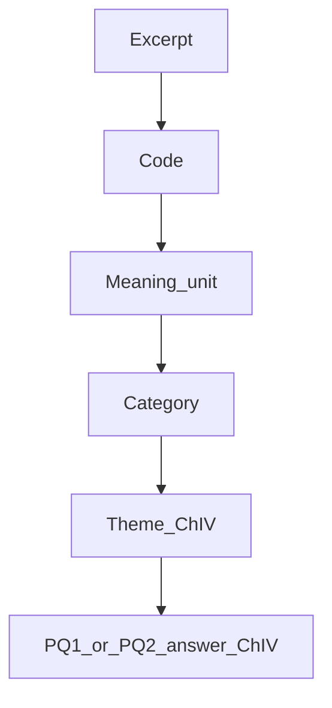

# Chapter III: Methodology

**Course:** RSCH-V8927 Doctoral Project Development — Framework Development (building on BMGT-8044)  
**Study:** Generic qualitative inquiry of U.S. SME IT and network managers’ IT disaster-recovery governance on external platforms (ITDRPaaS)  
**Instrument:** `ITDR-GQI-INT-v0.1.1` ([gqi-semistructured-interview-guide.md](gqi-semistructured-interview-guide.md))  
**Analytic method:** Hybrid deductive–inductive codebook thematic analysis (Fereday & Muir-Cochrane, 2006)  
**CAQDAS (support only):** Delve  
**Companion registers:** [symbols-definitions-refs.md](symbols-definitions-refs.md); [notion/](notion/README.md)  
**Weeks 8–10 SOP:** [amalgamation-wk8-10-qda-sop.md](amalgamation-wk8-10-qda-sop.md) (sample locked at n = 12)

**Paste note.** This file is written as Capella dissertation Chapter III prose. Official research-question wording has not been locked. Until it is, the two implied project questions below are labeled **PQ1** and **PQ2**. Replace those labels with the approved RQ wording without changing the unit of analysis.

**Implied project questions**

- **PQ1.** How do U.S. SME IT and network managers describe stakeholder-claim management and salience shifts (power, legitimacy, urgency) during ITDRPaaS recovery or testing incidents?
- **PQ2.** How do those shifts get enacted as decision rights, escalation pathways, and evidentiary / recoverability-assurance standards that managers can defend to stakeholders?

**Method-first wording (recommended for the Project Plan and for this chapter).** Transcripts, artifact maps, and field notes will be analyzed using a hybrid deductive–inductive codebook thematic analysis (Fereday & Muir-Cochrane, 2006). Delve computer-assisted qualitative data analysis software (CAQDAS) will be used to store de-identified transcripts, apply and version the codebook, write memos linked to excerpts, and retain unique snippet URLs for the audit trail (Carcary, 2020; Delve, Ho, & Limpaecher, n.d.). Delve will not perform the analysis.

Do not write: “Data will be analyzed using Delve.”

---

## Table of contents

1. [Introduction](#introduction)
2. [Research Design](#research-design)
3. [Population and Sampling](#population-and-sampling)
4. [Recruitment](#recruitment)
5. [Instrumentation](#instrumentation)
6. [Data Collection](#data-collection)
7. [Data Preparation and Management](#data-preparation-and-management)
8. [Qualitative Data Analysis](#qualitative-data-analysis)
9. [Trustworthiness](#trustworthiness)
10. [Ethical Protections](#ethical-protections)
11. [Chapter Summary](#chapter-summary)
12. [References](#references)

---

## Introduction

This chapter describes the methods that will be used to collect and analyze managers’ accounts of named IT disaster-recovery events on external platforms. The chapter is organized to match the Capella Alignment Map’s operations cluster: research design, population and sampling, recruitment, instrumentation, data collection, data preparation, qualitative data analysis, trustworthiness, and ethical protections (Capella University, n.d.-a, n.d.-b). The purpose of the procedures is to produce an auditable chain from the gap, through implied PQ1 and PQ2, through the interview instrument, through codes, categories, and themes, to the answers that Chapter IV will report and Chapter V will interpret.

The study is a generic qualitative inquiry (GQI) that uses critical-incident interviews (Caelli et al., 2003; Flanagan, 1954; Kahlke, 2014; Percy et al., 2015). The analytic method is hybrid codebook thematic analysis, not reflexive thematic analysis and not content analysis against NIST, ISO, or BCM checklists (Fereday & Muir-Cochrane, 2006). Stakeholder-salience constructs (power, legitimacy, urgency) and this study’s enactment constructs (decision rights, escalation, evidentiary standards, recoverability assurance) function as sensitizing probes (Mitchell et al., 1997). They are not pre-named themes and they are not findings. Leverage (`Lev`) is the enacted combination of those salience attributes in one named incident; it is not a fourth salience attribute.

Chapter III plans that chain. It does not claim final themes. Theme titles, patterned-meaning claims, and answers to PQ1 and PQ2 belong in Chapter IV. Interpretation, implications, and limitations belong in Chapter V.

---

## Research Design

### Generic qualitative inquiry

Generic qualitative inquiry is the congruent design because the object of study is managers’ patterned descriptions of external events, decisions, artifacts, and conditions, not the essence of a lived experience (Caelli et al., 2003; Kahlke, 2014; Percy et al., 2015; Capella University, n.d.-c). GQI permits theoretically informed interview items when those items stay in manager language and when the constructs that informed them are not treated as conclusions (Percy et al., 2015). That permission is why Sets L and A–F can be built from stakeholder-salience and enactment constructs without converting the study into a confirmatory test of Mitchell et al. (1997).

This design is not phenomenology. The chapter therefore does not use “lived experience,” “essence,” or “voices” as analytic claims. Participants are asked for accounts of a named disruption, failover, recovery test, or operational recovery, including who moved a decision and what counted as proof. The unit of analysis is one U.S. SME IT, network, systems, infrastructure, or operations manager recounting one qualifying incident in the preceding 36 months in which an external recovery platform or managed recovery service was used.

The design is also not an audit. NIST, ISO, and BCM materials may appear in What We Know as industry context, and a manager may name them during an incident account. They are not coding systems. Artifacts are not scored for compliance.

### Critical-incident interview stance

The interview stance is the critical incident technique (CIT), not a saturation-driven interview method (Flanagan, 1954; Chell, 2004; Butterfield et al., 2005). CIT is used because the gap is operational: how competing stakeholder claims were handled when restoration had to be ranked, delayed, or declared done. A named event supplies a bounded story in which salience can shift and in which decision rights, escalation, and proof can be observed as enacted, including when they were not used.

Guest et al. (2006) is not the interview method. That source is reserved for a later stopping discussion only.

### Framework role: sensitizing, not confirmatory

Stakeholder identification and salience theory specifies that managers’ attention to claims is a function of power, legitimacy, and urgency (Mitchell et al., 1997). Subsequent work tested and refined that mechanism and is used in this study as build-on literature, not as a replacement for the original definitions (Agle et al., 1999; Neville et al., 2011; Parent & Deephouse, 2007). The “why now” of the gap includes faster legitimacy judgments in contemporary informational environments (Dorobantu et al., 2024). Recoverability assurance is treated as decision-relevant, reviewable evidence that prioritized services can be restored within tolerance, as the project’s assurance sources define that term (Lowry et al., 2025; Park et al., 2023; bibliographic details pending verification).

Those sources sit on the Constructs and What We Know nodes. They do not pre-write Chapter IV themes. In analysis they justify a deductive start-list. Inductive codes are added only after meaning units are locked (Aronson, 1994; Fereday & Muir-Cochrane, 2006; Taylor & Bogdan, 1998).

### Alignment spine

The planned chain that this chapter must keep intact is:


| Spine node | This study |
| --- | --- |
| Problem | SME IT/network managers must handle competing restoration claims on external platforms without a clear account of how authority and proof are enacted under time pressure. |
| Purpose | Describe how those managers account for stakeholder-claim management and salience shifts in one named ITDRPaaS recovery or test event, and how those shifts are enacted as decision rights, escalation, and defensible proof. |
| Questions | Implied PQ1 (claim attention / salience shifts) and PQ2 (enactment as rights, escalation, proof). Official RQ wording will replace these labels when locked. |
| Framework | Mitchell et al. (1997) power, legitimacy, urgency as sensitizing attributes; leverage as the enacted combination; PQ2 constructs as enactment probes. |
| Data sources | Critical-incident interviews; optional redacted artifacts or verbal reconstructions of what those artifacts did in the event. |
| Instrument questions | `ITDR-GQI-INT-v0.1.1`: Q0; Set L; Sets A–F; Q-close; skip-if-covered; boundary cases. |
| Collection | One-to-one recorded video interviews, 60–75 minutes, plus artifact intake Paths A/B/C. |
| Codes | STRUCTURAL, FRAMEWORK_DEDUCTIVE, BOUNDARY, then EMERGENT after meaning-unit lock. |
| Categories | Grouped meaning units that describe the same salience-to-assurance bargain, named in Chapter IV. |
| Themes | Patterned-meaning claims, not topic headings, named in Chapter IV. |
| Findings / conclusions | Chapter IV reports; Chapter V interprets. Not claimed here. |

---

## Population and Sampling

### Population

The population is U.S. IT, network, systems, infrastructure, or operations managers in small and medium enterprises who have a direct role in disaster-recovery coordination that uses an external recovery platform or managed recovery service (ITDRPaaS). Firm size is bounded at 10 to 200 personnel so that the study stays inside SME governance rather than large-enterprise command structures. The population is not vendor staff whose only role is to operate the platform for clients, and it is not executives with no operational recovery role.

Inclusion requires at least one disruption, failover, recovery test, or operational recovery in the preceding 36 months in which that external platform or managed service was used. That incident is the interview’s unit of talk. A manager who cannot name a qualifying event is not in the sample.

### Sampling strategy

Sampling is purposive and criterion-based (Percy et al., 2015). The aim is information power, not a probability sample and not an automatic saturation claim (Malterud et al., 2016). Information power is expected to be relatively high because the aim is narrow (one class of SME recovery event), the participants are specific (IT/network managers with a named ITDRPaaS incident), the dialogue is theoretically informed without being a closed questionnaire, and the analysis is a cross-case codebook reduction rather than a surface inventory of topics (Malterud et al., 2016).

The sample is locked at 12 interviews. Twelve is the planned recruitment target, not a finding that the gap is closed, and not a claim that saturation occurs at the twelfth interview. Adequacy is justified by information power (Malterud et al., 2016). Stopping is an analytic decision documented from the codebook, boundary cases, and whether interviews in the locked corpus of 12 are still changing the meaning-unit inventory for PQ1 and PQ2 (Naeem et al., 2024). Guest et al. (2006) may be cited only in that stopping discussion, as evidence that some interview studies have observed early code stability in relatively homogeneous samples. It is not used to justify the CIT protocol or a claim that 12 interviews suffice.

---

## Recruitment

Candidates are approached individually through professional networks, practitioner associations, and professional social platforms. The researcher does not recruit through a supervisor, an employer’s command chain, or a vendor account manager. That rule is an ethical protection and a data-quality protection: a supervisor-visible invitation would raise the risk that contested authority and failed-proof talk—the exact material PQ2 requires—would be withheld or sanitized.

Screening uses the inclusion criteria stated above. After eligibility is confirmed, the informed-consent form is emailed. After signed electronic consent is returned, a 60- to 75-minute virtual interview in English is scheduled. A participant code `P##` is assigned before the call. Employer names are not spoken into the recording if they can be avoided.

If a candidate cannot name a qualifying incident in 36 months, the case fails inclusion. The researcher thanks the person and closes. No interview is continued from a generic “how we usually recover” account.

---

## Instrumentation

### Primary instrument

The primary instrument is the unpublished GQI semi-structured interview guide *Where leverage sits*, instrument ID `ITDR-GQI-INT-v0.1.1` (Walker, 2026). It does not create a new theoretical reference and does not displace Mitchell et al. (1997) or CIT sources. Spoken questions use manager language: pull, pressure, right to ask, time-critical, who made the call, what counted as proof. Theoretical labels stay in the researcher codebook and in the leverage memo (Percy et al., 2015; Capella University, n.d.-d).

The session is timed at 60–75 minutes:

| Segment | Items | Function |
| --- | --- | --- |
| Minutes 0–3 | Ethics script | Consent to record; optional artifacts; factual member check |
| Minutes 3–18 | **Q0** (required) | Critical-incident opening; one named event |
| Minutes 18–55 | **Set L**, then **Sets A–F** | Locate leverage, then power, legitimacy, urgency, decision rights, escalation, proof |
| Minutes 55–70 | **Q-close** and artifact request | Who had to be convinced, and with what |

**Q0** asks the participant to walk through one specific disruption, failover, recovery test, or operational recovery in the last 36 months where an external recovery platform or managed recovery service was used. Power, legitimacy, urgency, leverage, and proof are not introduced in Q0.

**Set L** locates where leverage sat: who actually moved restore order or could have stopped it (L1), what supplied that pull (L2), and what the manager would have done differently without it (L3). Leverage is the phenomenon. It is not a fourth Mitchell attribute.

**Sets A–C** collect power, legitimacy, and urgency examples only if Set L or Q0 did not already supply a concrete example. **Sets D–F** follow the same incident into decision rights, escalation, and evidentiary / recoverability proof (PQ2). **Q-close** asks whether anything about who had to be convinced, and with what, remains unasked.

Skip-if-covered is a procedure, not a convenience. After a skip, the coverage checklist is marked “covered in Q0” or “covered in L.” A set is not skipped because the topic feels familiar. It is skipped only when a concrete example already exists in the record.

Boundary cases are valid data. Nothing escalated, restoration accepted with no reviewable proof, a low-power claim that still won, and pull that the manager cannot locate are coded as `no_escalation`, `no_reviewable_proof`, `low_power_claim_won`, and `pull_unlocated`. They are not failed interviews.

### Researcher-only leverage diagnostic

After the session, from the transcript and notes, the researcher completes one leverage-memo row. The table is not read to the participant and is not offered as a forced choice. Allowed `attribute_mix` values map onto Mitchell type symbols as memo values only:

| Memo `attribute_mix` | Symbol | Mitchell type (memo only) |
| --- | --- | --- |
| power-only | `P` | dormant |
| legitimacy-only | `L` | discretionary |
| urgency-only | `U` | demanding |
| power+legitimacy | `P+L` | dominant |
| power+urgency | `P+U` | dangerous |
| legitimacy+urgency | `L+U` | dependent |
| definitive (all three) | `P+L+U` | definitive |
| unclear / none-observed | — | not a type; code `pull_unlocated` |

Mitchell type names are not imported into Delve as theme titles. They never appear as Chapter IV headings.

### Secondary instrument: artifacts as context

The secondary instrument is a review of objects the manager names while telling the incident: an internal disaster-recovery plan, escalation matrix, recovery-test record, ticket, integrity check, or authorization action. External frameworks such as NIST or BCM are recorded only when the manager names them, and only as context.

Three intake paths exist:

| Path | When | Capture | Do not |
| --- | --- | --- | --- |
| A. Redacted share | Participant can send a screenshot, PDF excerpt, or ticket print | File as `P##_ART##`; strip identifiers on receipt | Score against NIST/ISO/BCM |
| B. Verbal reconstruction | Participant cannot share the file | Type, who used it, who ignored it, whether it counted as proof | Invent contents the participant did not state |
| C. No artifact | Participant names none | Record “no reviewable artifact named” as a recoverability-assurance boundary | Treat as missing data that invalidates the interview |

Path A has a 14-calendar-day window. If nothing arrives, the row is recoded as Path B from session notes. Refusing to share a document does not end the interview.

---

## Data Collection

Each interview is one-to-one video, in English, audio- and video-recorded, with a running-notes backup. If the recorder fails, the session is stopped and rescheduled. The interview is not continued from memory.

Before the call the researcher confirms signed consent, confirms inclusion, assigns `P##`, and opens a blank coverage checklist, a blank leverage-memo row, and a blank artifact-map row. The ethics script is read aloud. If permission to record is refused, the session stops and any partial file is destroyed.

During Q0, if the participant stays with “how we usually recover,” the researcher asks them to remain with one event. If several events are named, the researcher asks for the most vivid or the one in which the recovery decision was hardest. If the timeline is thin, probes stay inside that event: what happened first, what the manager did next, who else was in that conversation. If the participant becomes distressed, the researcher pauses, offers to skip or stop, and does not press for graphic incident detail.

Flexible probes are not new questions. Allowed probes are requests for an example, for more about that moment, for who else was present, for what happened next, and silence after a thin answer. Forced choices are not offered (“power or legitimacy,” “NIST or BCM,” yes/no theory labels).

A session is complete for Alignment Tracking only when each construct row on the coverage checklist has a concrete example or a documented skip-plus-boundary. Completeness is a collection standard. It is not a finding.

---

## Data Preparation and Management

Preparation follows a three-state path. Delve is the store for the CLEAN and ANALYTIC states. It is not the analytic method.


**RAW.** The recording, running notes, and any artifact files as received. RAW files contain identifiers. They are stored in an encrypted, password-protected directory that is not copied into the public repository or into the Notion CSV nest.

**CLEAN.** A verbatim transcript is produced from the recording. Person names, employer names, vendor names, and product names are replaced with `P##`, role only, `SME-A`, and `Platform-1`. Speaker labels are inserted so Delve can split speakers. The CLEAN transcript is the file imported to Delve. Descriptors set at import are `participant_id`, `role_band`, `incident_type`, `firm_size_band`, and `instrument_version`. Descriptors are filters. They are not findings.

**ANALYTIC.** Codes, memos, and snippet URLs are applied inside Delve on the CLEAN transcript. The leverage diagnostic, skip reasons, boundary flags, and reflexive notes are memos linked to snippets. Interval exports of Codes and Snippets are dropped into `docs/notion/interval-backups/YYYY-MM-DD/` with an append-only `update-log.csv` row (Carcary, 2020). Delve snippet URLs remain in the backup CSV so an auditor can retrace excerpt → code → memo.

Member checking occurs on the CLEAN transcript, not on ANALYTIC theme names. The de-identified transcript is sent within ten days. The participant has seven calendar days to mark factual corrections of sequence, roles, and artifact type. Participants may not delete a de-identified contested recovery decision from the analytic file. Non-response after seven days is recorded as “no factual corrections returned,” and analysis proceeds.

---

## Qualitative Data Analysis

### Declaration of method

The analytic method is **hybrid deductive–inductive codebook thematic analysis** (Fereday & Muir-Cochrane, 2006). That method is required because this study’s Alignment Map spine needs (a) a map from implied PQ1 and PQ2 onto instrument items, (b) a versioned codebook that another reader can inspect, and (c) an auditable chain from excerpt to code to category to theme. Fereday and Muir-Cochrane integrated a theory-informed template of codes with data-driven inductive codes. This study uses the same hybrid logic: FRAMEWORK_DEDUCTIVE and BOUNDARY codes are the template; EMERGENT child codes are added only after meaning units are locked.

This is a **single-researcher dissertation**. The default trustworthiness tactics are therefore an audit trail, codebook versioning, negative and boundary cases, reflexive memos, and referential adequacy (Lincoln & Guba, 1985; Nowell et al., 2017). Cohen’s kappa and other intercoder reliability (ICR) statistics are not part of the default design. If the committee later requires a second coder, the optional subsection at the end of this section will be activated. ICR will not be mixed with a claim that the study is doing Braun and Clarke’s reflexive thematic analysis.

Braun and Clarke (2019, 2021, 2022) are cited for quality of thematic practice, not as the analytic method:

- Codes are not themes.
- Themes are patterned meanings, not topic headings such as “Governance” or “Power.”
- The write-up does not say that themes “emerged.”
- Frequency of a code is not evidence of importance.

Practice 2 from the BMGT-8044 sequence still governs theme naming: lock meaning units that state a practice claim before any theme name is written (Aronson, 1994; Taylor & Bogdan, 1998; Walker, 2026).

### Why this method and not the adjacent alternatives

| Adjacent choice | Why it is not the method |
| --- | --- |
| Reflexive thematic analysis (Braun & Clarke, 2019, 2021, 2022) | Reflexive TA does not use a start-list codebook as the spine, and it is incompatible with ICR as a quality claim. This study needs RQ mapping and a versioned codebook. |
| Purely inductive TA with no template | Would hide the theoretically informed instrument and would not give an auditable PQ1/PQ2 map. |
| Purely deductive coding that “confirms” Mitchell et al. (1997) | Would pre-write findings and would violate Practice 2. |
| Content analysis / NIST–ISO–BCM scoring | Would convert GQI accounts into an audit. |
| “Analyzed using Delve” | Names the store as if it were the method. |

### Analytic steps (adapted hybrid codebook TA)

The steps below adapt Fereday and Muir-Cochrane (2006) to a single-researcher GQI with a CIT corpus. Dual-coder “code reliability” is not Stage 2 of the default design.

1. **Develop the code manual.** Import the nested start-list in [notion/templates/codebook.csv](notion/templates/codebook.csv). Each FRAMEWORK_DEDUCTIVE and BOUNDARY code already states what it means, what it is not, an example type, and that it is not a theme title.
2. **Apply STRUCTURAL and FRAMEWORK_DEDUCTIVE codes to CLEAN transcripts.** Tag excerpts by PQ1/PQ2, context, and unanticipated content, then apply sensitizing probes where a concrete example or a documented boundary exists. Co-occurrence is not used to name themes.
3. **Lock meaning units before any EMERGENT code or theme name.** A meaning unit is a practice-claim sentence grounded in a named excerpt (Aronson, 1994; Taylor & Bogdan, 1998). Until that sentence exists, the EMERGENT parent stays empty.
4. **Add inductive (EMERGENT) codes** for patterned claims that the template does not already name. Do not copy `power`, `legitimacy`, `urgency`, or `leverage_location` into EMERGENT.
5. **Group related meaning units into categories** only when they describe the same salience-to-assurance bargain, not merely the same recovery topic.
6. **Name themes as claims.** A theme is a patterned-meaning sentence that can be evidenced with excerpts and limited by at least one negative or boundary case across the corpus (Braun & Clarke, 2021; Nowell et al., 2017).
7. **Synthesize two separate answers.** One answer addresses PQ1 (claim attention and salience shifts). The other addresses PQ2 (enactment as decision rights, escalation, and proof). A single “governance” theme is not an answer to either question.
8. **Export and backup.** Codes, snippets, and memos are exported to the dated CSV nest. Code renames, merges, and drops are memoed the same day.



### Delve nested start-list (import; do not treat as themes)

```
STRUCTURAL
  PQ1_claim_attention
  PQ2_enactment
  CONTEXT
  UNANTICIPATED
FRAMEWORK_DEDUCTIVE  (sensitizing; not findings)
  leverage_location
  power
  legitimacy
  urgency
  decision_rights
  escalation
  evidentiary_standards
  recoverability_assurance
BOUNDARY
  no_escalation
  no_reviewable_proof
  low_power_claim_won
  pull_unlocated
EMERGENT
  (empty until meaning units locked)
```

STRUCTURAL codes file excerpts. They do not answer PQ1 or PQ2. FRAMEWORK_DEDUCTIVE codes collect examples. They are not Chapter IV titles. BOUNDARY codes limit over-broad claims. EMERGENT is empty at first code.

### Planned-analysis matrix

This matrix is a Chapter III planning object. The Theme and Finding columns stay empty until Chapter IV. Official RQ labels, when locked, replace PQ1/PQ2 in the Maps-to column without changing question IDs.

| Question ID | Set | One-line purpose | Maps to | Structural code | Planned framework / boundary codes | Category (Ch. IV) | Theme (Ch. IV) | Finding (Ch. IV) |
| --- | --- | --- | --- | --- | --- | --- | --- | --- |
| Q0 | CIT | Named incident narrative | PQ1 (context for both) | `CONTEXT`; then `PQ1_claim_attention` as the story supplies claims | none a priori; later dual-code with framework codes if examples appear | | | |
| L1 | L | Who moved or could stop restore order | PQ1 | `PQ1_claim_attention` | `leverage_location`; `pull_unlocated` if unnamed | | | |
| L2 | L | What supplied the pull | PQ1 | `PQ1_claim_attention` | `leverage_location` plus `power` / `legitimacy` / `urgency` as evidenced | | | |
| L3 | L | Counterfactual without that pull | PQ1 | `PQ1_claim_attention` | `leverage_location` | | | |
| A1 | A | Whose pressure ranked restore order | PQ1 | `PQ1_claim_attention` | `power`; `low_power_claim_won` if applicable | | | |
| A2 | A | Who could delay, override, or stop | PQ1 | `PQ1_claim_attention` | `power` | | | |
| A3 | A | Counterfactual without that pressure | PQ1 | `PQ1_claim_attention` | `power` | | | |
| B1 | B | Whose claim was treated as rightful | PQ1 | `PQ1_claim_attention` | `legitimacy` | | | |
| B2 | B | Claim treated as out of line | PQ1 | `PQ1_claim_attention` | `legitimacy` | | | |
| C1 | C | What made one service/stakeholder time-critical | PQ1 | `PQ1_claim_attention` | `urgency` | | | |
| C2 | C | Whether time pressure changed mid-incident | PQ1 | `PQ1_claim_attention` | `urgency` | | | |
| D1 | D | Supposed vs actual decision maker | PQ2 | `PQ2_enactment` | `decision_rights` | | | |
| D2 | D | Authority needed but absent | PQ2 | `PQ2_enactment` | `decision_rights` | | | |
| E1 | E | Escalation trigger | PQ2 | `PQ2_enactment` | `escalation`; `no_escalation` if none | | | |
| E2 | E | Effect on speed or on “done” | PQ2 | `PQ2_enactment` | `escalation`; `no_escalation` if none | | | |
| F1 | F | What counted as enough proof | PQ2 | `PQ2_enactment` | `evidentiary_standards`; `no_reviewable_proof` if none | | | |
| F2 | F | Proof renegotiated mid-incident | PQ2 | `PQ2_enactment` | `evidentiary_standards` | | | |
| F3 | F | What the manager would point to | PQ2 | `PQ2_enactment` | `recoverability_assurance`; `no_reviewable_proof` if Path C | | | |
| Q-close | CLOSE | Who had to be convinced, and with what | PQ1 and PQ2 | `PQ1_claim_attention` and/or `PQ2_enactment` | `leverage_location` as closing map; `UNANTICIPATED` if new | | | |

Skip-if-covered rows are still mapped. If A1 is skipped because L1 already named the mover, the L1 excerpt carries the `power` code when the example is a force/override example, or another framework code when it is not. The matrix does not require every ID to be asked aloud.

### Ten control rules

These rules govern coding, memoing, and write-up. A violation is a dependability incident and is logged the same day.

1. **Method first, software second.** Name hybrid codebook thematic analysis, then name Delve as CAQDAS storage and audit support. Never write that data will be analyzed using Delve.
2. **Codes are not themes.** `power`, `legitimacy`, `urgency`, `leverage_location`, and the PQ2 enactment codes collect examples. They are not Chapter IV headings.
3. **Themes are claims.** A theme is a patterned-meaning sentence, not a topic label such as “Governance,” “Escalation,” or “Proof.”
4. **Do not write that themes “emerged.”** Name the researcher action: meaning units were locked, grouped, and synthesized (Braun & Clarke, 2019, 2021).
5. **Frequency is not importance.** A code’s snippet count does not make it a theme and does not answer PQ1 or PQ2.
6. **Lock meaning units before theme names.** EMERGENT stays empty until Practice 2 Step 1 is complete (Aronson, 1994; Taylor & Bogdan, 1998).
7. **Leverage is not a fourth salience attribute.** `Lev` is the enacted combination of P, L, and/or U in the named incident.
8. **Mitchell type names stay in memos.** `P`, `L`, `U`, `P+L`, `P+U`, `L+U`, and `P+L+U` map to `attribute_mix`. They are not Delve theme titles.
9. **NIST, ISO, and BCM are context.** They are not coding systems and are not used to score artifacts.
10. **Chapter III plans; Chapter IV reports; Chapter V interprets.** The Theme and Finding cells in this chapter remain empty. Guest et al. (2006) is not the interview method. GQI language stays on accounts of named events, decisions, and artifacts.

### Chapter III versus Chapter IV versus Chapter V

| Object | Chapter III | Chapter IV | Chapter V |
| --- | --- | --- | --- |
| PQ1 / PQ2 (or official RQs) | Stated as questions to be answered | Answered with evidenced themes | Interpreted against the gap and literature |
| FRAMEWORK_DEDUCTIVE codes | Imported as sensitizing probes | Cited only as the start-list that collected examples | Not restated as if they were findings |
| Meaning units | Procedure for locking them | Displayed as evidenced claims | Not re-analyzed as new data |
| Categories / themes | Planned, unnamed | Named as patterned meanings; limited by boundary cases | Discussed, not newly named |
| Leverage memo / `attribute_mix` | Field-memo procedure | May be tabulated as analytic description, not as a finding that “confirms” Mitchell types | Related back to salience literature without treating memo labels as themes |
| Delve / CSV nest | Named as audit infrastructure | Used to locate excerpts | Not a contribution |
| Implications / recommendations | Not offered | Not offered | Offered |

### Optional: committee-required second coder and ICR

This subsection is inactive unless the supervisory committee requires a second coder. The study remains a single-researcher dissertation if the subsection is never activated.

If activated, a second coder would apply the imported codebook to a pre-specified subset of CLEAN transcripts after meaning units for that subset have been locked by the researcher. Disagreements would be recorded in a memo and resolved by codebook revision, not by forcing consensus onto theme titles (O’Connor & Joffe, 2020). Any percentage agreement or kappa statistic would be reported as a codebook-communication check, not as evidence that themes are “reliable” and not as a substitute for the audit trail (Nowell et al., 2017; O’Connor & Joffe, 2020). Reflexive thematic analysis would still not be claimed, because ICR and reflexive TA are not mixed in this design (Braun & Clarke, 2019, 2021).

---

## Trustworthiness

This project uses the qualitative criteria of credibility, dependability, confirmability, and transferability (Lincoln & Guba, 1985; Korstjens & Moser, 2018; Nowell et al., 2017). Reporting will be checked against SRQR items and, where they fit a single-researcher interview study, against COREQ items that do not require multiple coders as a quality condition (O’Brien et al., 2014; Tong et al., 2007). Checklists are reporting aids. They are not the analytic method.

**Credibility.** Each interview stays with one named incident long enough to show whether attention moved and what counted as proof. The coverage checklist prevents a skipped set from disappearing. Boundary cases are retained. Member checking is limited to factual accuracy so that contested recovery decisions are not edited out of the CLEAN file.

**Dependability.** The written protocol, the versioned codebook, Delve snippet URLs, memos, and the dated CSV nest constitute the audit trail (Carcary, 2020; Lincoln & Guba, 1985). Another reader should be able to move from a Chapter IV excerpt back to a snippet URL, a code description, and an update-log row.

**Confirmability.** A reflexive memo is written within 24 hours of each interview so that sensitizing labels used as probes are not mistaken for findings (Braun & Clarke, 2019). Referential adequacy is supported by holding RAW recordings and CLEAN transcripts so that later analytic claims can be compared with the source talk (Lincoln & Guba, 1985). Negative and boundary cases are required across the corpus for each construct that the instrument set out to collect.

**Transferability.** Role band, firm-size band, platform type, and incident type are described without naming organizations. No claim is made that 12 U.S. SME managers represent all ITDRPaaS settings.

The main threats to those claims are organizational disclosure risk, dual identifiability, supervisor-visible recruitment, political sanitizing during member check, and researcher allegiance to the sensitizing list. Mitigations are optional artifact sharing with a verbal-reconstruction fallback, identifier stripping, individual recruitment, a seven-day factual-only member check, encrypted RAW storage, empty EMERGENT until meaning-unit lock, and at least one boundary case per construct across the corpus.

Saturation is not treated as a trustworthiness badge that 12 interviews automatically earn. It is an analytic decision guide applied to whether interviews in the locked corpus of 12 are still changing the meaning-unit inventory for PQ1 and PQ2 (Malterud et al., 2016; Naeem et al., 2024).

---

## Ethical Protections

The study will be submitted to the Capella University Institutional Review Board before recruitment. Participation is voluntary. Participants may skip any question or stop at any time without penalty. Informed consent is obtained electronically before the interview is scheduled. Permission to record is confirmed again in the opening script.

Identifiers are stripped from transcripts and from any shared artifact. Names of people, employers, vendors, and products are replaced with role and alphanumeric codes. The public CSV nest and any courseroom appendix contain no RAW identifiers.

Organizational risk is treated as a Gap-data threat, not only as a compliance item. Managers who fear internal exposure may withhold the authority and proof talk that PQ2 requires. Artifact sharing is therefore optional. A verbal reconstruction of what a document did in the event is sufficient. Restoration accepted with no reviewable proof remains in the file as a boundary case rather than as missing data.

Member checking is factual only and time-bounded. Distressed participants are offered a pause, a skip, or a stop; graphic incident detail is not pursued. Recordings, RAW notes, and identifiable artifacts are stored in an encrypted, password-protected directory separate from the CLEAN/ANALYTIC export path. Retention follows Capella IRB conditions.

---

## Chapter Summary

Chapter III specified a generic qualitative inquiry that uses critical-incident interviews with U.S. SME IT and network managers who can name one ITDRPaaS recovery or test event in 36 months. The sample is locked at 12 participants and is justified by information power rather than by automatic saturation. The instrument `ITDR-GQI-INT-v0.1.1` locates leverage in that event and then follows the same incident into decision rights, escalation, and recoverability proof, using skip-if-covered rules and boundary cases.

The analytic method is hybrid deductive–inductive codebook thematic analysis (Fereday & Muir-Cochrane, 2006), adapted for a single researcher. Delve is the CAQDAS that stores CLEAN transcripts, the versioned codebook, memos, and snippet URLs. It does not analyze the data. STRUCTURAL, FRAMEWORK_DEDUCTIVE, and BOUNDARY codes are imported as filing and sensitizing devices. EMERGENT stays empty until meaning units are locked. Theme names, patterned-meaning claims, and answers to PQ1 and PQ2 are reserved for Chapter IV. Interpretation is reserved for Chapter V.

---

## References

Agle, B. R., Mitchell, R. K., & Sonnenfeld, J. A. (1999). Who matters to CEOs? An investigation of stakeholder attributes and salience, corporate performance, and CEO values. *Academy of Management Journal, 42*(5), 507–525. https://doi.org/10.5465/256973

Aronson, J. (1994). A pragmatic view of thematic analysis. *The Qualitative Report, 2*(1), 1–3. https://doi.org/10.46743/2160-3715/1995.2069

Braun, V., & Clarke, V. (2019). Reflecting on reflexive thematic analysis. *Qualitative Research in Sport, Exercise and Health, 11*(4), 589–597. https://doi.org/10.1080/2159676X.2019.1628806

Braun, V., & Clarke, V. (2021). One size fits all? What counts as quality practice in (reflexive) thematic analysis? *Qualitative Research in Psychology, 18*(3), 328–352. https://doi.org/10.1080/14780887.2020.1769238

Braun, V., & Clarke, V. (2022). *Thematic analysis: A practical guide*. SAGE.

Butterfield, L. D., Borgen, W. A., Amundson, N. E., & Maglio, A.-S. T. (2005). Fifty years of the critical incident technique: 1954–2004 and beyond. *Qualitative Research, 5*(4), 475–497. https://doi.org/10.1177/1468794105056924

Caelli, K., Ray, L., & Mill, J. (2003). ‘Clear as mud’: Toward greater clarity in generic qualitative research. *International Journal of Qualitative Methods, 2*(2), 1–13. https://doi.org/10.1177/160940690300200201

Capella University. (n.d.-a). *The alignment map: Guiding questions* [Interactive courseroom media]. RSCH-V8927.

Capella University. (n.d.-b). *Project plan alignment tracking* [Courseroom media]. RSCH-V8927.

Capella University. (n.d.-c). *Qualitative data collection and analysis methods – SOBT*. https://campustools.capella.edu/BBCourse_Production/PhD_Colloquia/Track_3/SOBT/phd_t3_sobt_u02s6_h01_qualcoll.html

Capella University. (n.d.-d). *Writing guiding questions*. https://campustools.capella.edu/BBCourse_Production/PhD_Colloquia_C4C/Track_3/phd_t3_u07s1_writeguide.html

Carcary, M. (2020). The research audit trail: Methodological guidance for application in practice. *Electronic Journal of Business Research Methods, 18*(2), 166–177. https://doi.org/10.34190/jbrm.18.2.008

Chell, E. (2004). Critical incident technique. In C. Cassell & G. Symon (Eds.), *Essential guide to qualitative methods in organizational research* (pp. 45–60). SAGE.

Delve, Ho, L., & Limpaecher, A. (n.d.). *Qualitative data analysis software*. Delve. https://delvetool.com/

Donaldson, T., & Preston, L. E. (1995). The stakeholder theory of the corporation: Concepts, evidence, and implications. *Academy of Management Review, 20*(1), 65–91. https://doi.org/10.5465/amr.1995.9503271992

Dorobantu, S., Henisz, W. J., & Nartey, L. J. (2024). Firm–stakeholder dialogue and the media: The evolution of stakeholder evaluations in different informational environments. *Academy of Management Journal, 67*(1), 92–125. https://doi.org/10.5465/amj.2021.0103

Fereday, J., & Muir-Cochrane, E. (2006). Demonstrating rigor using thematic analysis: A hybrid approach of inductive and deductive coding and theme development. *International Journal of Qualitative Methods, 5*(1), 80–92. https://doi.org/10.1177/160940690600500107

Flanagan, J. C. (1954). The critical incident technique. *Psychological Bulletin, 51*(4), 327–358. https://doi.org/10.1037/h0061470

Freeman, R. E., Wicks, A. C., & Parmar, B. (2004). Stakeholder theory and “the corporate objective revisited.” *Organization Science, 15*(3), 364–369. https://doi.org/10.1287/orsc.1040.0066

Guest, G., Bunce, A., & Johnson, L. (2006). How many interviews are enough? An experiment with data saturation and variability. *Field Methods, 18*(1), 59–82. https://doi.org/10.1177/1525822X05279903

Kahlke, R. M. (2014). Generic qualitative approaches: Pitfalls and benefits of methodological mixology. *International Journal of Qualitative Methods, 13*(1), 37–52. https://doi.org/10.1177/160940691401300119

Korstjens, I., & Moser, A. (2018). Series: Practical guidance to qualitative research. Part 4: Trustworthiness and publishing. *European Journal of General Practice, 24*(1), 120–124. https://doi.org/10.1080/13814788.2017.1375092

Lester, J. N., Cho, Y., & Lochmiller, C. R. (2020). Learning to do qualitative data analysis: A starting point. *Human Resource Development Review, 19*(1), 94–106. https://doi.org/10.1177/1534484320903890

Lincoln, Y. S., & Guba, E. G. (1985). *Naturalistic inquiry*. SAGE.

Lowry, P. B., Petter, S., & Leimeister, J. M. (2025). [Recoverability assurance and decision-relevant evidence as used in the project plan; full bibliographic details pending verification].

Malterud, K., Siersma, V. D., & Guassora, A. D. (2016). Sample size in qualitative interview studies: Guided by information power. *Qualitative Health Research, 26*(13), 1753–1760. https://doi.org/10.1177/1049732315617444

Mitchell, R. K., Agle, B. R., & Wood, D. J. (1997). Toward a theory of stakeholder identification and salience: Defining the principle of who and what really counts. *Academy of Management Review, 22*(4), 853–886. https://doi.org/10.5465/amr.1997.9711022105

Naeem, M., Ozuem, W., Howell, K., & Ranfagni, S. (2024). Demystification and actualisation of data saturation in qualitative research through thematic analysis. *International Journal of Qualitative Methods, 23*, 1–17. https://doi.org/10.1177/16094069241229777

Neville, B. A., Bell, S. J., & Whitwell, G. J. (2011). Stakeholder salience revisited: Refining, redefining, and refueling an underdeveloped conceptual tool. *Journal of Business Ethics, 102*(3), 357–378. https://doi.org/10.1007/s10551-011-0818-9

Nowell, L. S., Norris, J. M., White, D. E., & Moules, N. J. (2017). Thematic analysis: Striving to meet the trustworthiness criteria. *International Journal of Qualitative Methods, 16*(1), 1–13. https://doi.org/10.1177/1609406917733847

O’Brien, B. C., Harris, I. B., Beckman, T. J., Reed, D. A., & Cook, D. A. (2014). Standards for reporting qualitative research: A synthesis of recommendations. *Academic Medicine, 89*(9), 1245–1251. https://doi.org/10.1097/ACM.0000000000000388

O’Connor, C., & Joffe, H. (2020). Intercoder reliability in qualitative research: Debates and practical guidelines. *International Journal of Qualitative Methods, 19*, 1–13. https://doi.org/10.1177/1609406919899220

Parent, M. M., & Deephouse, D. L. (2007). A case study of stakeholder identification and prioritization by managers. *Journal of Business Ethics, 75*(1), 1–23. https://doi.org/10.1007/s10551-007-9533-y

Park, J., et al. (2023). [Recoverability-assurance definition source as used in the project plan; full bibliographic details pending verification].

Percy, W. H., Kostere, K., & Kostere, S. (2015). Generic qualitative research in psychology. *The Qualitative Report, 20*(2), 76–85. https://doi.org/10.46743/2160-3715/2015.2097

Taylor, S. J., & Bogdan, R. (1998). *Introduction to qualitative research methods* (3rd ed.). Wiley.

Tong, A., Sainsbury, P., & Craig, J. (2007). Consolidated criteria for reporting qualitative research (COREQ): A 32-item checklist for interviews and focus groups. *International Journal for Quality in Health Care, 19*(6), 349–357. https://doi.org/10.1093/intqhc/mzm042

Walker, M. (2026). *GQI semi-structured interview guide: Where leverage sits* (Instrument ID ITDR-GQI-INT-v0.1.1) [Unpublished research instrument]. Capella University, RSCH-V8927.

Walker, M. D. (2026, August 16). *Week 5 assignment: Data analysis practice 2* [Unpublished course paper]. BMGT-8044, Capella University.
