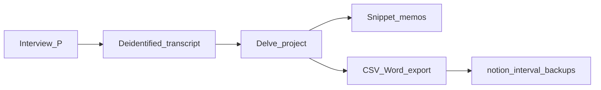

# GQI Semi-Structured Interview Guide: Where Leverage Sits

**Instrument ID:** `ITDR-GQI-INT-v0.1.1`  
**Course:** RSCH-V8927 Doctoral Project Development — Framework Development (building on BMGT-8044)  
**Study:** Generic qualitative inquiry of U.S. SME IT/network managers’ disaster-recovery governance on external platforms (ITDRPaaS)  
**Alignment Map nodes filled:** Measures/Artifacts; Data Collection; Procedures; Dependability  
**CAQDAS:** Delve (audit trail, codebook, snippet URLs)  
**Interval backup:** [docs/notion/](notion/README.md) CSV nest  
**Reference class:** **new unpublished instrument** — does not replace seminal theory (see [Section 9](#9-seminal-references-vs-this-new-instrument))  
**Companions (v0.1.1; spoken wording unchanged):** [Chapter III: Methodology](chapter-iii-methodology.md) · [Symbols, definitions, and original vs build-on refs](symbols-definitions-refs.md) · [Weeks 8–10 QDA SOP](amalgamation-wk8-10-qda-sop.md) (n = 12 locked)

---

## Table of contents

1. [Purpose and Alignment Map placement](#1-purpose-and-alignment-map-placement)
2. [How to use this instrument](#2-how-to-use-this-instrument)
3. [Leverage diagnostic (researcher only)](#3-leverage-diagnostic-researcher-only)
4. [Spoken protocol (60–75 minutes)](#4-spoken-protocol-60-75-minutes)
5. [Construct-to-question map](#5-construct-to-question-map)
6. [Coverage checklist and leverage memo](#6-coverage-checklist-and-leverage-memo)
7. [Do / do not](#7-do--do-not)
8. [Delve auditable capabilities](#8-delve-auditable-capabilities)
9. [Seminal references vs this new instrument](#9-seminal-references-vs-this-new-instrument)
10. [Link, TOC, index](#10-link-toc-index)
11. [How to update](#11-how-to-update)
12. [Sources cited in this instrument](#12-sources-cited-in-this-instrument)

**Quick index:** [Question ID index](#question-id-index) · [Construct index](#construct-index) · [CSV backup index](#csv-backup-index) · [Chapter III](chapter-iii-methodology.md) · [Symbols glossary](symbols-definitions-refs.md)

---

## 1. Purpose and Alignment Map placement

This is the paste-ready **Measures/Artifacts** instrument for the study. Participants complete it by answering. The researcher completes the coverage checklist and leverage memo so **Data Collection** has visible steps.

The phenomenon is **leverage**: who could actually move restore order, delay an action, or redefine “done” in one named recovery or test event. Stakeholder-salience attributes remain the **Constructs** node, not the spoken script (Mitchell et al., 1997):

| Construct (codebook only) | What it means in this incident |
| --- | --- |
| Power | Capacity to force, withhold, or override |
| Legitimacy | Claim treated as rightful (role, plan, contract, regulation) |
| Urgency | Time-critical demand that reorders attention |

Leverage is the **enacted combination**. The interview locates *where it sat*, then follows the same incident into decision rights, escalation, and recoverability proof (PQ2).

**Implied project questions** (replace with official wording when locked; do not change the unit of analysis):

- **PQ1.** How do U.S. SME IT and network managers describe stakeholder-claim management and salience shifts (power, legitimacy, urgency) during ITDRPaaS recovery or testing incidents?
- **PQ2.** How do those shifts get enacted as decision rights, escalation pathways, and evidentiary / recoverability-assurance standards that managers can defend to stakeholders?

**Unit of analysis:** one U.S. SME IT/network/systems/infrastructure/operations manager; one named disruption, failover, recovery test, or operational recovery in the last 36 months that used an external recovery platform or managed recovery service.

Theoretical words (salience, legitimacy, recoverability assurance, leverage as a theory term) stay in the researcher codebook. Spoken questions use manager language (Flanagan, 1954; Chell, 2004; Percy et al., 2015; Capella guiding-question rules).

---

## 2. How to use this instrument

**Length:** 60–75 minutes.  
**Modality:** One-to-one video; English; audio- and video-recorded with a running-notes backup.  
**Skip rule:** Ask Sets L then A–F only if the Q0 story did not already supply a concrete example. After a skip, mark “covered in Q0” on the [coverage checklist](#6-coverage-checklist-and-leverage-memo).  
**Stop rule:** If the participant cannot name any qualifying event in 36 months, the case fails inclusion. Thank and close.  
**Theme rule:** Power, Legitimacy, Urgency, Leverage, Decision Rights, Escalation, Evidentiary Standards, and Recoverability Assurance are **sensitizing probes**. They are not Data Analysis theme titles. Lock meaning units before any theme name is written (Aronson, 1994; Taylor & Bogdan, 1998; Braun & Clarke, 2021).

### 2.1 Pre-session checklist

1. Confirm signed electronic consent is on file.
2. Confirm inclusion: U.S. SME, 10–200 personnel; IT/network/systems/infrastructure/operations manager; direct role in external-platform or managed recovery; at least one disruption, failover, test, or operational recovery in 36 months; not vendor-only employed.
3. Assign participant code `P##` before the call. Do not speak the employer name into the recording if it can be avoided.
4. Start recorder. If recorder fails, stop and reschedule. Do not continue from memory.
5. Open a blank coverage checklist, a blank leverage memo row, and a blank artifact map row.

---

## 3. Leverage diagnostic (researcher only)

Complete **after** the session, from the transcript and notes. Do **not** read this table to the participant. Do **not** offer a forced choice (“was it power or legitimacy?”). This row is a field memo, not a finding.

| Memo field | Allowed values | Rule |
| --- | --- | --- |
| `leverage_locus` | Who actually moved restore order, delayed an action, or redefined “done” (role only, no name) | Must be grounded in a named moment in the incident |
| `attribute_mix` | `power-only` · `legitimacy-only` · `urgency-only` · `power+legitimacy` · `power+urgency` · `legitimacy+urgency` · `definitive (all three)` · `unclear` · `none-observed` | Check only attributes that have a concrete example **or** a documented boundary |
| `formal_vs_enacted` | `matched` · `diverged` · `unknown` | Compare written/role claim with what actually moved the decision |
| `boundary_flag` | `Y/N` plus one clause | Examples: no escalation; restoration accepted with no reviewable proof; low-power claim that still won |
| `delve_memo_id` | Delve memo URL or local ID after import | Link back to the transcript snippet |

`none-observed` and `unclear` are valid. They are not failed interviews.

---

## 4. Spoken protocol (60–75 minutes)

### 4.1 Minutes 0–3: Ethics script (read aloud)

> Thank you for meeting. This interview is part of a doctoral study of how IT and network managers in U.S. small and medium enterprises handle recovery decisions when they use an external recovery platform. Participation is voluntary. You may skip any question or stop at any time without penalty. I will record the session so I can transcribe it. I will remove your name, your employer’s name, vendor names, and product names from the transcript. You do not have to share any confidential disaster-recovery document. If you mention a plan, ticket, or test record, you may describe what it did in the event, or share a redacted excerpt if your organization allows it. Refusing to share a document does not end the interview. After transcription I will send you a de-identified transcript and ask you to correct anything I misheard. You will have seven calendar days to reply. Correcting a factual error is welcome. The analysis will still include de-identified accounts of contested recovery decisions. Do I have your permission to begin recording and to continue?

If no: stop, thank the participant, destroy any partial file.

### 4.2 Minutes 3–18: Critical-incident opening (PQ1)

**Q0 (required).**

> Please walk me through one specific disruption, failover, recovery test, or operational recovery in the last 36 months where you used an external recovery platform or managed recovery service. Start wherever the event became your problem, and tell me what happened in as much detail as you can.

| If the participant… | Researcher does this |
| --- | --- |
| Stays with “how we usually recover” | *If you can, stay with that one event rather than with how recovery usually works.* |
| Names several events | *Which one is the most vivid, or the one where the recovery decision was hardest? Let’s stay with that one.* |
| Cannot name any event in 36 months | Stop. The case fails inclusion. Thank and close. |
| Gives a thin timeline | *What happened first? What did you do next? Who else was in that conversation?* |
| Becomes distressed | Pause. Offer to skip or stop. Do not press for graphic incident detail. |

Do not introduce power, legitimacy, urgency, leverage, or proof in Q0. Let the story run.

### 4.3 Minutes 18–55: Topical guiding questions

Ask in this order. Skip a set if the incident narrative already answered it with a concrete example.

#### Set L — Where leverage sat (PQ1)

Use manager language for pull, stop, and move. Do not say “leverage,” “salience,” or “stakeholder attribute.”

- **L1.** *In that event, who actually moved what got restored first — or who could have stopped it?*
- **L2.** *What gave that person or group the ability to move the decision — their position, a written rule, the clock, something else?*
- **L3.** *If that pull had not been there, what would you have done differently?*

If L2 already yields a concrete example of power, legitimacy, or urgency, skip the matching Set A/B/C item and mark “covered in L.”

#### Set A — Power (PQ1)

- **A1.** *In that event, whose request or pressure most affected what got restored first?*
- **A2.** *Was there anyone who could delay, override, or stop a recovery action you thought was right?*
- **A3.** *If that pressure had not been there, what would you have done differently?*

Skip A3 if L3 already answered it.

#### Set B — Legitimacy (PQ1)

- **B1.** *Whose claim to a service or a recovery order did people treat as having a right to ask for it?*
- **B2.** *Was anyone’s request treated as out of line or outside their role? What happened then?*

Do not ask “Did you experience a legitimacy problem?” That hides an assumption.

#### Set C — Urgency (PQ1)

- **C1.** *What made one service or one stakeholder more time-critical than another in that event?*
- **C2.** *Did that sense of time pressure change while you were working the incident? What changed it?*

Spoken wording is “time-critical” / “time pressure,” not the codebook word “urgency,” unless the participant uses it first.

#### Set D — Decision rights (PQ2)

- **D1.** *Who was supposed to make the call on that tradeoff, and who actually made it?*
- **D2.** *Was there a moment when you needed authority you did not have? What did you do?*

#### Set E — Escalation (PQ2)

- **E1.** *What, if anything, triggered an escalation?*
- **E2.** *Did escalation speed the restoration, slow it, or change what “done” meant?*

If the participant says nothing was escalated, that is a **boundary case**, not a failed interview. Record it.

#### Set F — Evidentiary standards and recoverability assurance (PQ2)

- **F1.** *When you told others the service was recovered, what did you treat as enough proof?*
- **F2.** *Did anyone ask for different proof mid-incident? What did you do?*
- **F3.** *Looking back, what would you point to — a log, a test, an approval, a ticket — if you had to defend that restoration?*

If F3 names an artifact, run the artifact request immediately. Do not wait until the close if the artifact is central to the story.

### 4.4 Minutes 55–70: Close and artifact request

**Q-close.**

> Is there anything about who had to be convinced, and with what, that I have not asked about?

**Artifact request** (after F3 or after Q-close):

> You mentioned [plan / matrix / ticket / test / approval]. I do not need a confidential file. If you are allowed to share a redacted excerpt, that helps me see how the written process compared with what you actually did. If you cannot share it, please just describe what that document or record did in the event — who used it, who ignored it, and whether it counted as proof.

Then:

> I will send the de-identified transcript within ten days. You will have seven calendar days to mark factual corrections. Thank you.

**Artifact intake (researcher):**

| Path | When | Capture | Do not |
| --- | --- | --- | --- |
| A. Redacted share | Participant can send a screenshot, PDF excerpt, or ticket print after the call | File as `P##_ART##`; strip identifiers on receipt | Score against NIST/ISO/BCM |
| B. Verbal reconstruction | Participant cannot share the file | Type, who used it, who ignored it, whether it counted as proof | Invent contents the participant did not state |
| C. No artifact | Participant names none | Record “no reviewable artifact named” as a recoverability-assurance **boundary case** | Treat as missing data that invalidates the interview |

Path A deadline: 14 calendar days. If nothing arrives, recode as Path B from session notes.

### 4.5 Flexible probes only (not new questions)

- *What would be an example of that?*
- *Please say more about that moment.*
- *Who else was in that conversation?*
- *What did you do next?*
- Silence, or *Mmm*, after a thin answer.

Do not offer forced choices (yes/no, “power or legitimacy,” “NIST or BCM”).

---

## 5. Construct-to-question map

Each Gap construct must have a collectable example **or** a documented skip-plus-boundary. This table is the Alignment Map test for Measures/Artifacts.

| Gap / construct | PQ | Spoken item(s) | Collectable example | Boundary / negative case |
| --- | --- | --- | --- | --- |
| Leverage location | PQ1 | L1, L2, L3, Q-close | Named person/role who moved restore order, delayed an action, or redefined “done,” plus what supplied that pull | No one could move the decision; pull sat nowhere the manager could name |
| Power | PQ1 | A1, A2, A3 (or covered in L/Q0) | Who could force, delay, or override | Low-power claim that still won; pressure present but unused |
| Legitimacy | PQ1 | B1, B2 (or covered in L/Q0) | Whose claim was treated as rightful, or treated as out of line | Written plan/role ignored; unofficial claim treated as rightful |
| Urgency | PQ1 | C1, C2 (or covered in L/Q0) | What made restoration time-critical, and whether that ranking moved | Clock did not reorder work; urgency claimed but not acted on |
| Decision rights | PQ2 | D1, D2 | Who was supposed to decide vs who did | Authority needed but absent; unofficial decision maker |
| Escalation | PQ2 | E1, E2 | Trigger, and effect on speed or on “done” | Nothing was escalated |
| Evidentiary standards | PQ2 | F1, F2 | What counted as enough proof; whether proof was renegotiated | Restoration accepted with no reviewable proof |
| Recoverability assurance | PQ2 | F3 + artifact path A/B/C | Named log, test, approval, ticket, or verbal reconstruction of what that record did | Path C: no reviewable artifact named |
| Who cares / why now | Gap | Q-close | Who had to be convinced, and with what | Participant says nothing further; record as closed, not empty |

---

## 6. Coverage checklist and leverage memo

Complete during or immediately after the session. A session is complete for Alignment Tracking only when each construct row has a concrete example **or** a documented skip-plus-boundary.

### 6.1 Construct coverage

| Construct | Covered in Q0? | Covered in L? | Set used | Concrete example captured? | Artifact named? | Boundary / negative case? |
| --- | --- | --- | --- | --- | --- | --- |
| Leverage location | | | L / skip | Y/N | Y/N | |
| Power | | | A / skip | Y/N | Y/N | |
| Legitimacy | | | B / skip | Y/N | Y/N | |
| Urgency | | | C / skip | Y/N | Y/N | |
| Decision rights | | | D / skip | Y/N | Y/N | |
| Escalation | | | E / skip | Y/N | Y/N | |
| Evidentiary standards | | | F / skip | Y/N | Y/N | |
| Recoverability assurance | | | F / skip | Y/N | Y/N | |

### 6.2 Leverage memo (one row per interview)

| Field | Entry |
| --- | --- |
| Participant | `P##` |
| Incident type | disruption / failover / test / operational recovery |
| `leverage_locus` | |
| `attribute_mix` | |
| `formal_vs_enacted` | matched / diverged / unknown |
| `boundary_flag` | |
| `delve_memo_id` | |
| Instrument version | `ITDR-GQI-INT-v0.1.1` |

Copy the same row into [docs/notion/templates/leverage-memo.csv](notion/templates/leverage-memo.csv) after the session, then into the dated interval backup.

---

## 7. Do / do not

**Do**

- Keep one named incident.
- Skip a set when Q0 or Set L already produced a concrete example.
- Record boundary cases (no escalation, no proof, low-power claim that won).
- Keep theoretical labels in Delve code descriptions and this codebook, not in spoken questions.
- Export Delve codebook + snippets to the Notion CSV nest on the interval in [Section 11](#11-how-to-update).

**Do not**

- Ask “Did you experience a legitimacy / power / urgency / leverage problem?”
- Offer forced choices (“power or legitimacy,” “NIST or BCM”).
- Promote Power, Legitimacy, Urgency, or Leverage to theme titles.
- Score artifacts against NIST, ISO, or BCM.
- Use phenomenology language (lived experience, essence, voices).
- Cite Guest et al. (2006) as the interview method. CIT sources are Flanagan (1954), Chell (2004), and Butterfield et al. (2005).
- Treat this protocol as a new *theory* reference that replaces Mitchell et al. (1997).

---

## 8. Delve auditable capabilities

Delve is the CAQDAS that makes this instrument **dependable** (Lincoln & Guba, 1985; Nowell et al., 2017; Carcary, 2020). It does not analyze for the researcher. Use only the capabilities below. Leave the Emergent parent empty until meaning units are locked.

### 8.1 What to turn on in the Delve project

| Delve capability | How this instrument uses it | Audit object |
| --- | --- | --- |
| Central codebook with nested codes | Import the start-list in [docs/notion/templates/codebook.csv](notion/templates/codebook.csv). Nest under `STRUCTURAL`, `FRAMEWORK_DEDUCTIVE`, and `BOUNDARY`. Keep `EMERGENT` empty at first code. | Code name, description, nested level, snippet count |
| Code descriptions | Each sensitizing code must state: what it means, what it is not, one example type, and “not a theme title.” | Codebook export |
| Transcripts | One de-identified transcript per `P##`. Paste speaker labels so Delve can split speakers. | Transcript file + descriptors |
| Descriptors | `participant_id`, `role_band`, `incident_type`, `firm_size_band`, `instrument_version` | Filter/sort; never a finding |
| Snippets + unique URLs | Every coded excerpt keeps Delve’s snippet URL so a CSV row can jump back to source | Snippet CSV |
| Memos linked to snippets | Leverage diagnostic, skip-reason, boundary-case, and reflexive notes | Memo text + snippet URL |
| Code history / revisions | When a code is renamed, merged, or dropped, write a memo *why* the same day | Update log + memo |
| Co-occurrence (optional, after themes exist) | Check whether power/legitimacy/urgency snippets co-occur with proof snippets. Do not use co-occurrence to name themes. | Matrix export |
| Export to CSV / Word | Interval backup into `docs/notion/interval-backups/YYYY-MM-DD/` | Dated CSV nest |
| AI apply-codes (if used at all) | Review, accept, or reject each suggestion. Never accept a theme name from AI. Record the review in a memo. | AI-review memo |

### 8.2 Delve nested start-list (import; do not treat as themes)

`SENSITIZING_STARTLIST` is retired in `v0.1.1`. Import this nest (same as Chapter III):

```
STRUCTURAL
  PQ1_claim_attention
  PQ2_enactment
  CONTEXT
  UNANTICIPATED
FRAMEWORK_DEDUCTIVE  (sensitizing; not findings)
  leverage_location
  power
  legitimacy
  urgency
  decision_rights
  escalation
  evidentiary_standards
  recoverability_assurance
BOUNDARY
  no_escalation
  no_reviewable_proof
  low_power_claim_won
  pull_unlocated
EMERGENT
  (empty until meaning units locked)
```

Code descriptions for the four PQ1 salience codes must include: *Sensitizing probe only. Do not promote to a theme title. Lock a meaning-unit practice sentence first.*

### 8.3 Transcript → Delve → CSV path



1. De-identify the transcript (`P##`, role only, `SME-A`, `Platform-1`).
2. Upload to Delve. Set descriptors. Code with the start-list. Write the leverage memo on the L1–L3 snippets.
3. Export **Codes** and **Snippets** as CSV (and Word if the courseroom wants a readable codebook).
4. Drop both files into `docs/notion/interval-backups/YYYY-MM-DD/` using the names in [Section 11](#11-how-to-update).
5. Append one row to `update-log.csv`.

Delve snippet exports embed unique URLs back to the project. Keep those URLs in the backup CSV so an auditor can retrace excerpt → code → memo.

---

## 9. Seminal references vs this new instrument

**This file does not create a new theoretical reference.** It creates a **new unpublished research instrument** (Measures/Artifacts). Cite it in the Project Plan as an appendix or as Walker (2026), *GQI semi-structured interview guide: Where leverage sits* (Unpublished research instrument, Capella University). It does not displace Mitchell et al. (1997) or CIT sources.

| Class | What it is | Create new? | How to cite / link |
| --- | --- | --- | --- |
| Seminal theory | Stakeholder salience: power, legitimacy, urgency | No | Mitchell, Agle, & Wood (1997). Keep on the Constructs node. |
| Seminal stakeholder context | Claim management; corporate objective | No | Donaldson & Preston (1995); Freeman et al. (2004). Gap / What We Know only. |
| Seminal method — GQI | Patterned accounts of events, decisions, conditions | No | Caelli et al. (2003); Kahlke (2014); Percy et al. (2015). |
| Seminal method — CIT | One named incident as the interview stance | No | Flanagan (1954); Chell (2004); Butterfield et al. (2005). |
| Seminal method — analysis | Meaning units before theme names | No | Aronson (1994); Taylor & Bogdan (1998); Braun & Clarke (2021). |
| Seminal trustworthiness | Dependability / confirmability audit trail | No | Lincoln & Guba (1985); Nowell et al. (2017); Korstjens & Moser (2018); Carcary (2020). |
| Software | CAQDAS used to store codes, memos, snippet URLs | **New software citation if not already in the plan** | Delve, Ho, & Limpaecher (n.d./year of page used), plus the product URL. Software is not a theory source. |
| This protocol | Spoken questions, skip rules, coverage checklist, leverage memo | **Yes — new unpublished instrument** | `ITDR-GQI-INT-v0.1.1`. Link from Project Plan Measures/Artifacts to this file. Version on every update. Spoken wording is unchanged from v0.1. |
| Delve codebook CSV | Dated export of codes and snippets | **Yes — audit artifact, not literature** | File name + date in `docs/notion/interval-backups/`. Do not cite as a scholarly source. |

Full allowed-use rows live in [docs/notion/templates/references.csv](notion/templates/references.csv).

---

## 10. Link, TOC, index

### How objects link

| From | To | Key |
| --- | --- | --- |
| Project Plan Measures/Artifacts | This file | Instrument ID `ITDR-GQI-INT-v0.1.1` |
| This file | [Chapter III](chapter-iii-methodology.md) | Planned-analysis matrix; hybrid codebook TA |
| This file | [Symbols glossary](symbols-definitions-refs.md) | `P` `L` `U` `Lev` `DR` `ESC` `EV` `RA` |
| Spoken question | Construct | Question ID (`L1`, `A2`, …) in [Section 5](#5-construct-to-question-map) and `interview-items.csv` |
| Construct | Delve code | `code_id` in `codebook.csv` |
| Coded excerpt | Transcript | Delve snippet URL in snippets CSV |
| Leverage memo | Snippet | `delve_memo_id` |
| Interval backup | Instrument version | `instrument_version` column on every CSV |

Notion (when the workspace is connected): create a parent page **ITDR-GQI audit nest** with child databases whose properties match the CSV headers. Until then, the repo folder [docs/notion/](notion/README.md) is the nested backup.

### Question ID index

| ID | Set | One-line purpose | Skip if |
| --- | --- | --- | --- |
| Q0 | CIT open | Named incident narrative | Never (required) |
| L1 | Leverage | Who moved or could stop restore order | Q0 already named the mover with a concrete moment |
| L2 | Leverage | What supplied the pull (position, rule, clock, other) | L1 already stated the source |
| L3 | Leverage | Counterfactual without that pull | Q0 already stated the counterfactual |
| A1 | Power | Whose pressure ranked restore order | Covered in L/Q0 |
| A2 | Power | Who could delay, override, or stop | Covered in L/Q0 |
| A3 | Power | Counterfactual without that pressure | Covered in L3 |
| B1 | Legitimacy | Whose claim was treated as rightful | Covered in L/Q0 |
| B2 | Legitimacy | Claim treated as out of line | Covered in L/Q0 |
| C1 | Urgency | What made one service/stakeholder time-critical | Covered in L/Q0 |
| C2 | Urgency | Whether time pressure changed mid-incident | Covered in L/Q0 |
| D1 | Decision rights | Supposed vs actual decision maker | Covered in Q0 |
| D2 | Decision rights | Authority needed but absent | Covered in Q0 |
| E1 | Escalation | Trigger | Covered in Q0; “nothing escalated” is a boundary, not a skip without a note |
| E2 | Escalation | Effect on speed or on “done” | No escalation recorded as boundary |
| F1 | Proof | What counted as enough proof | Covered in Q0 |
| F2 | Proof | Proof renegotiated mid-incident | Covered in Q0 |
| F3 | Proof / artifact | What the manager would point to | Covered in Q0; then artifact request |
| Q-close | Gap | Who had to be convinced, and with what | Never (required close) |

### Construct index

| Construct | Question IDs | Delve `code_id` | Parent | CSV |
| --- | --- | --- | --- | --- |
| Leverage location | L1 L2 L3 Q-close | `leverage_location` | `FRAMEWORK_DEDUCTIVE` | codebook.csv, leverage-memo.csv, symbols.csv |
| Power | A1 A2 A3 | `power` | `FRAMEWORK_DEDUCTIVE` | codebook.csv, symbols.csv |
| Legitimacy | B1 B2 | `legitimacy` | `FRAMEWORK_DEDUCTIVE` | codebook.csv, symbols.csv |
| Urgency | C1 C2 | `urgency` | `FRAMEWORK_DEDUCTIVE` | codebook.csv, symbols.csv |
| Decision rights | D1 D2 | `decision_rights` | `FRAMEWORK_DEDUCTIVE` | codebook.csv, symbols.csv |
| Escalation | E1 E2 | `escalation` | `FRAMEWORK_DEDUCTIVE` | codebook.csv, symbols.csv |
| Evidentiary standards | F1 F2 | `evidentiary_standards` | `FRAMEWORK_DEDUCTIVE` | codebook.csv, symbols.csv |
| Recoverability assurance | F3 | `recoverability_assurance` | `FRAMEWORK_DEDUCTIVE` | codebook.csv, symbols.csv |

### CSV backup index

| File | Role |
| --- | --- |
| [docs/notion/README.md](notion/README.md) | Nest rules, interval, how to update |
| [docs/notion/templates/references.csv](notion/templates/references.csv) | Seminal vs new vs software; `origin` = original \| build_on \| new_instrument \| software \| audit_artifact |
| [docs/notion/templates/symbols.csv](notion/templates/symbols.csv) | Symbol, original vs operational def, spoken stand-in |
| [docs/notion/templates/interview-items.csv](notion/templates/interview-items.csv) | Question bank |
| [docs/notion/templates/codebook.csv](notion/templates/codebook.csv) | Delve start-list (`STRUCTURAL` / `FRAMEWORK_DEDUCTIVE`) |
| [docs/notion/templates/construct-index.csv](notion/templates/construct-index.csv) | Construct ↔ question ↔ code |
| [docs/notion/templates/leverage-memo.csv](notion/templates/leverage-memo.csv) | One row per interview |
| [docs/notion/templates/update-log.csv](notion/templates/update-log.csv) | Version and export history |
| [docs/notion/interval-backups/2026-08-27/](notion/interval-backups/2026-08-27/) | Seed backup of the v0.1 templates |
| [docs/notion/interval-backups/2026-08-27-chiii/](notion/interval-backups/2026-08-27-chiii/) | Chapter III / symbols / codebook-nest backup |
| [docs/chapter-iii-methodology.md](chapter-iii-methodology.md) | Paste-ready Chapter III |
| [docs/symbols-definitions-refs.md](symbols-definitions-refs.md) | Notation register |

---

## 11. How to update

Bump the instrument version **before** changing spoken wording. Never silently edit a live question ID.

| Change type | What to do | Version bump |
| --- | --- | --- |
| Typo, heading, TOC link | Edit this file; one `update-log.csv` row `type=copyedit` | Patch: `v0.1` → `v0.1.1` (this file: companion links; spoken wording unchanged) |
| Probe wording, skip rule, ethics script | Edit this file **and** `interview-items.csv`; re-export Delve codebook if a code description changed | Minor: `v0.1` → `v0.2` |
| Add/drop a question ID or construct | New IDs only (do not reuse a retired ID). Update construct-index, codebook, Delve nest, both CSV templates and a new dated backup folder | Minor or major: `v0.2` or `v1.0` if PQ wording or unit of analysis changes |
| Official project questions locked | Replace implied PQ1/PQ2 in Section 1; do not change unit of analysis | Minor: `v0.x` |
| Delve export (no wording change) | Copy Codes.csv and Snippets.csv into a new `interval-backups/YYYY-MM-DD/` folder; log `type=delve_export` | No instrument bump |

**Interval:** after each interview that is coded, and at least weekly while coding is active. If no new coding occurred that week, log `type=no_change` so the gap is visible.

**Folder drop pattern:**

```
docs/notion/interval-backups/YYYY-MM-DD/
  codebook.csv
  snippets.csv          (from Delve; empty seed until interviews exist)
  interview-items.csv
  references.csv
  construct-index.csv
  leverage-memo.csv
  symbols.csv
  update-log.csv        (append-only copy of the running log)
```

**Retired IDs:** keep the row in `interview-items.csv` with `status=retired` and `replaced_by=`. Do not delete. Auditors must see what a past transcript was asked.

---

## 12. Sources cited in this instrument

Aronson, J. (1994). A pragmatic view of thematic analysis. *The Qualitative Report, 2*(1), 1–3. https://doi.org/10.46743/2160-3715/1995.2069

Braun, V., & Clarke, V. (2021). One size fits all? What counts as quality practice in (reflexive) thematic analysis? *Qualitative Research in Psychology, 18*(3), 328–352. https://doi.org/10.1080/14780887.2020.1769238

Butterfield, L. D., Borgen, W. A., Amundson, N. E., & Maglio, A.-S. T. (2005). Fifty years of the critical incident technique: 1954–2004 and beyond. *Qualitative Research, 5*(4), 475–497. https://doi.org/10.1177/1468794105056924

Caelli, K., Ray, L., & Mill, J. (2003). ‘Clear as mud’: Toward greater clarity in generic qualitative research. *International Journal of Qualitative Methods, 2*(2), 1–13. https://doi.org/10.1177/160940690300200201

Carcary, M. (2020). The research audit trail: Methodological guidance for application in practice. *Electronic Journal of Business Research Methods, 18*(2), 166–177. https://doi.org/10.34190/jbrm.18.2.008

Chell, E. (2004). Critical incident technique. In C. Cassell & G. Symon (Eds.), *Essential guide to qualitative methods in organizational research* (pp. 45–60). SAGE.

Delve, Ho, L., & Limpaecher, A. (n.d.). *Qualitative data analysis software*. Delve. https://delvetool.com/

Donaldson, T., & Preston, L. E. (1995). The stakeholder theory of the corporation: Concepts, evidence, and implications. *Academy of Management Review, 20*(1), 65–91. https://doi.org/10.5465/amr.1995.9503271992

Flanagan, J. C. (1954). The critical incident technique. *Psychological Bulletin, 51*(4), 327–358. https://doi.org/10.1037/h0061470

Freeman, R. E., Wicks, A. C., & Parmar, B. (2004). Stakeholder theory and “the corporate objective revisited.” *Organization Science, 15*(3), 364–369. https://doi.org/10.1287/orsc.1040.0066

Kahlke, R. M. (2014). Generic qualitative approaches: Pitfalls and benefits of methodological mixology. *International Journal of Qualitative Methods, 13*(1), 37–52. https://doi.org/10.1177/160940691401300119

Korstjens, I., & Moser, A. (2018). Series: Practical guidance to qualitative research. Part 4: Trustworthiness and publishing. *European Journal of General Practice, 24*(1), 120–124. https://doi.org/10.1080/13814788.2017.1375092

Lincoln, Y. S., & Guba, E. G. (1985). *Naturalistic inquiry*. SAGE.

Mitchell, R. K., Agle, B. R., & Wood, D. J. (1997). Toward a theory of stakeholder identification and salience: Defining the principle of who and what really counts. *Academy of Management Review, 22*(4), 853–886. https://doi.org/10.5465/amr.1997.9711022105

Nowell, L. S., Norris, J. M., White, D. E., & Moules, N. J. (2017). Thematic analysis: Striving to meet the trustworthiness criteria. *International Journal of Qualitative Methods, 16*(1), 1–13. https://doi.org/10.1177/1609406917733847

Percy, W. H., Kostere, K., & Kostere, S. (2015). Generic qualitative research in psychology. *The Qualitative Report, 20*(2), 76–85. https://doi.org/10.46743/2160-3715/2015.2097

Taylor, S. J., & Bogdan, R. (1998). *Introduction to qualitative research methods* (3rd ed.). Wiley.

Walker, M. (2026). *GQI semi-structured interview guide: Where leverage sits* (Instrument ID ITDR-GQI-INT-v0.1.1) [Unpublished research instrument]. Capella University, RSCH-V8927.
